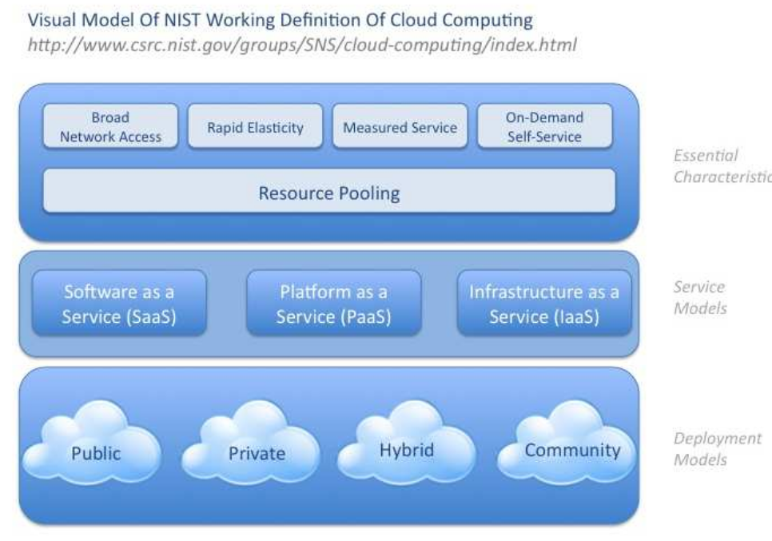
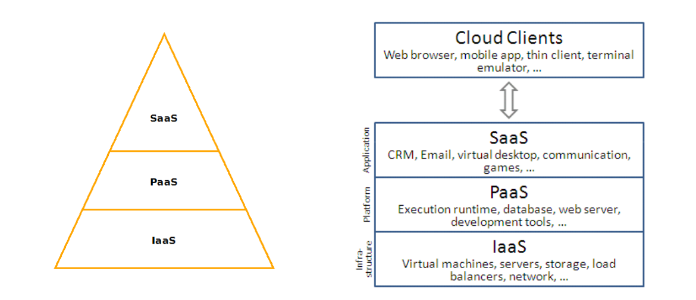

# Cloud computing y computación distribuida

## ***Cloud Computing***

### ¿Qué es *cloud computing*?

***Cloud Computing***  es un paradigma o modelo que permite ofrecer servicios de computación bajo demanda a través de una red. El objetivo es utilizar la tecnología para implantar infraestructuras “invisibles” que permitan convertir recursos como computación, almacenamiento, redes, aplicaciones, etc. en un servicio donde se pague por su uso  sin que sean necesarias inversiones iniciales. Permite a las organizaciones externalizar parte de su cómputo y de su almacenamiento a un proveedor que típicamente ofrece un modelo de pago por uso, o crear nubes privadas (*on-premise*) para tener las ventajas de las tecnologías cloud dentro de una organización, sin necesidad de depender de un proveedor público.

### ¿Qué es un cloud?

La nube (*cloud*) es por lo tanto una metáfora que engloba recursos virtuales y físicos alojados y ofrecidos por un determinado proveedor (Cloud de Google, Cloud de Amazon, Cloud de Microsoft, ....) o de forma privada. Cada proveedor ofrece su servicios con un modelo de pago por uso (tiempo de uso de CPU, uso de almacenamiento, tráfico de red, etc..) siendo el objetivo principal ajustar el consumo de recursos a las necesidades de las aplicaciones y usuarios de forma dinámica, elástica y rápida adaptando el consumo a la demanda.  

En el modelo tradicional las inversiones en hardware se quedan obsoletas en poco tiempo y la demanda de recursos de cómputo puede ser muy variable. Si hay un sobre-dimensionamiento parte de los recursos no son utilizados y es necesaria una inversión de hardware para determinados intervalos de tiempo, y con un sub-dimensionamiento si hay picos de carga que no se pueden atender, no se ofrece el servicio de forma adecuada.

### Características de un *cloud*

La Computación en Nube es un modelo para permitir el acceso ubicuo, conveniente y bajo demanda mediante red a un conjunto compartido de recursos de cómputo configurables (redes, servidores, almacenamiento, aplicaciones y servicios) que pueden ser rápidamente aprovisionados y liberados con mínimo esfuerzo de gestión o interacción con el proveedor del servicio [NIST Definition](https://www.nist.gov/news-events/news/2011/10/final-version-nist-cloud-computing-definition-published).

- **Servicio disponible de forma automática y bajo demanda (*On-demand self-service*)**
    - Un usuario puede comenzar a utilizar un recurso (almacenamiento, aplicación, máquina virtual, etc.) sin necesidad interactuar con operador de la empresa que ofrece el servicio cloud .

- **Accesible a través de red (*Broad network access*)**
    - Acceso a los servicios a través de una red usando distintos tipos de clientes (PC, portátil, móvil, tableta, ...)

- **Los recursos se agrupan en *pools* (*Resource pooling*)**
    - El proveedor del cloud ofrece recursos (capacidad de computo, almacenamiento, ancho de banda, ...) a los
usuarios.
    - Los recursos se agrupan en pools y son ofrecidos según un modelo ***multi-tenant***.
        - Diferentes recursos reales y virtuales son asignados y reasignados a los clientes bajo demanda.
        - Cada usuario/cliente se denomina *“tenant”*.
        - Los recursos son “virtualizados”, cada recurso real es utilizado concurrentemente por varios *“tenant”*.
        - Se debe garantizar separación, aislamiento, seguridad y privacidad.

- **Elasticidad (*Rapid elasticity*)**
    - Asignar/desasignar recursos rápidamente (preferiblemente de forma automática) según las necesidades del usuario.
        - Adaptación de los recursos usados frente a demandas cambiantes.
        - Aprovisionamiento frente a solicitudes de demanda dinámicas: "recursos ilimitados".
    - Escalado vertical (*scale up/scale down*)
    - Escalado horizontal (*scale out/scale in*)

- **Servicio medido (*Measured Service*)**
    - El uso de los recursos por parte de los usuarios se puede medir facilitando su control y optimización.
    - **Pago por uso** de recursos en entornos comerciales.

### Modelo de despliegue (tipos de *cloud*)

Existen tres modelos a la hora de desplegar un *cloud*:

- **Cloud público**
    - Servicio abierto al público ofrecido por un proveedor.
    - Recursos hardware propiedad del proveedor.
    - Gestión del *cloud* por parte del proveedor.
    - Suscripción del usuarios en el  proveedor (el tiempo que quieras).
    - Pago por uso (usuarios, empresas, organizaciones, etc.).

- **Cloud privado**
    - Uso exclusivo de una organización y/o múltiples usuarios.
    - Gestión del *cloud* por la propia organización.
    - Puede delegarse la gestión y operación a una compañía especializada.
    - Recursos hardware propios.

- **Cloud híbrido**
    - Dos o más infraestructuras de cloud distintas que aparecen como entidad única.
    - Combinan ambos modelos de *cloud* (privado o público). Por ejemplo, se delega temporalmente en un *cloud* público cuando se excede la capacidad de cómputo de un cloud privado.

### Modelo de servicios

El campo de *cloud computing* es muy amplio y es posible realizar varias clasificaciones y diferenciar entre múltiples tipos de *cloud* con diversidad de matices, pero la clasificación más genérica y extendida es la que se propone a continuación.

- ***Software as a service (SaaS)***
    - Orientado a usuarios.
    - Aplicaciones ejecutando sobre una infraestructura cloud son ofrecidas como servicio.
    - Los usuarios pagan por el uso, no por poseer el software (ni siquiera licencias)
    - Ejemplos: Dropbox, Google Drive, Evernote, Office 365, ... 

- ***Platform as a service (PaaS)***
    - Orientado a desarrolladores.
    - Plataforma de software y entornos de desarrollo y pruebas ofrecidos como servicio.
    - Abstrae hardware y servicios.
    - Permite el despliegue y ejecución de aplicaciones.
    - Servicio para todas las fases de desarrollo y pruebas de software.
    - Ejemplos
        - Proveedores de PaaS públicos: OpenShitft, Heroku, Google App Engine, Microsoft Azure, Amazon Web Services, Force.com, Jelastic …
        - Software para desplegar PaaS: OpenShitft Origin, , Cloudfoundry, Dokku, Tsuru, Apache Stratos, ...

- ***Infrastructure as a service (IaaS)***
    - Orientado a administradores. 
    - Capacidades de cómputo,  almacenamiento y red (máquinas/hardware) ofrecidas como servicio. Se ofrecen máquinas virtuales.
    - Ejemplos
        - Proveedores de Iaas:  Amazon Web Services, RackSpace, Google Compute Engine, Microsoft Azure Service Plataform, HP Cloud, GoGrid, …
        - Software para desplegar IaaS:  OpenStack,  OpenNebula, Cloudstack, Eucalyptus, Vmware vCloud, ...

[Cloud Service Models (IaaS, PaaS, SaaS) Diagram](https://dachou.github.io/2018/09/28/cloud-service-models.html)

De hecho, la tendencia es ofrecer cada vez más cualquier tipo de recurso como un servicio y se suele hablar del término:  ***XaaS (Anything as a Service)***.

### Presentación

En la siguiente presentación es posible ampliar informacion: [OpenStackLDV-Introducción al Cloud Computing](OpenStackLDV-Introducción al Cloud Computing.pdf)

## Computación distribuida

La **computación distriuida** es el arte de construir grandes sistemas divididos en muchas máquinas que proveen un servicio. Cientos o miles de máquinas pueden estar implicadas y servir a millones de usuarios.  Contrasta con sistemas limitados donde un solo servidor ejecuta un único servicio al que los clientes acceden simultáneamente.

La computación distribuida es hoy día ubicua y hace posibles (fiables, escalables y rápidos) los servicios que usamos a
diario. Popularmente se la conoce como *cloud* o *cloud computing*.

Ha transformado completamente el sector.

- Los fallos son algo asumido por diseño (hay miles de máquinas).   
- Sistemas antifrágiles (no solo resisten sino que mejoran con los fallos).
- Sistemas distribuidos, sin puntos únicos de fallo (SPoF).
- Se ofrecen los recursos en pools, de forma elástica (posteriormente se explica este concepto) y encapsulada,como si fuesen infinito.

La información anterior es una extracto de la presentación [OpenStackLDV-Computación distribuida](OpenStackLDV-Computación distribuida.pdf), realizada por [Flossystems](https://flossystems.com/), que contiene información muy útil e interesante sobre construir infraestucturas IT en producción, el cambio de paradigma que se esta produciendo, principos DevOS, Automatización,etc.

