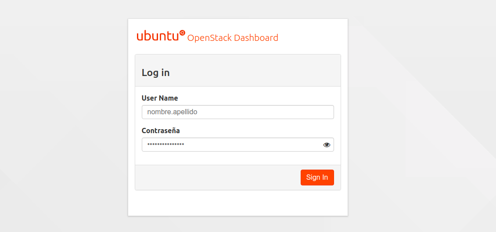
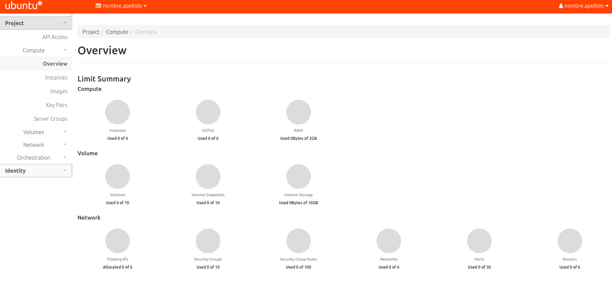
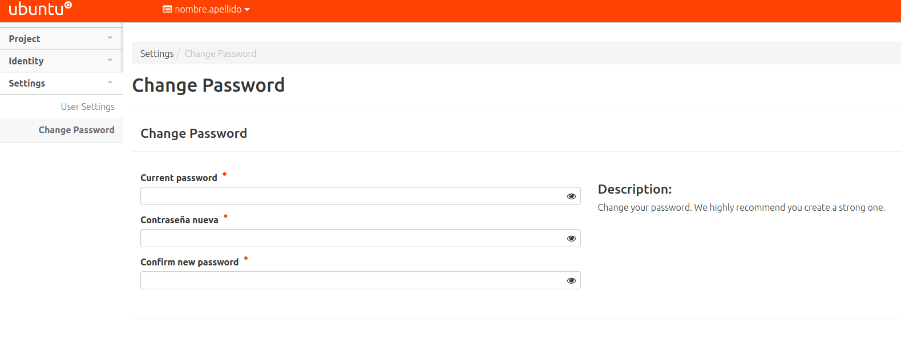
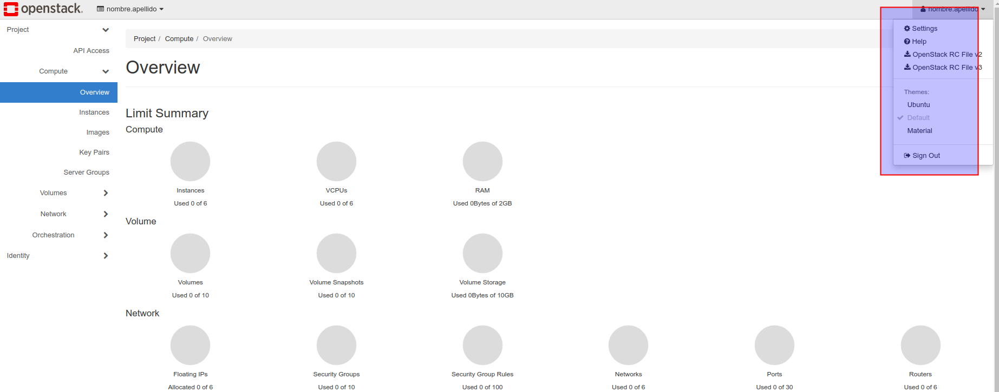

# Primeros pasos en OpenStackLDV

## Solicitud de cuenta de usuario y proyecto

Para poder acceder a los servicios de OpenStackLDV tienes que disponer de una cuenta de **usuario** con acceso a un **proyecto** (*tenant*).

Cada **usuario** (*user*) dispone de una cuenta y puede ser miembro de uno o varios proyectos. 

Un **proyecto** (o *tenant*) es una arupación de recursos del cloud (núcleos de procesador -VCPU-, RAM o espacio de almacenamiento) disponible para uno o más usuarios. Los recursos disponibles se definen a través de ***quotas***. Pueden crearse proyectos para un usuario, un departamento, una organización, ... Por convención, cuando un proyecto contienen a un solo usuario se suele denominar igual que el usuario.

En **OpenstackLDV** de forma predeterminada cada usuario pertenece a un proyecto con su mismo nombre pero puede ser miembro de más de un proyecto (p.e. 2ASIR-SRI, 2ASIR-SAD, Profesores, ...)

Las operaciones que un usuario puede realizar sobre un proyecto quedan determinadas por un **rol** (*role*) (conjunto de permisos que establecen qué operaciones puede realizar un usuario en un proyecto dado).

Solicita tu usuario y contraseña de acceso a tus profesores.

## Acceso a Horizon

Una vez que dispongas de tu nombre de usuario y contraseña puedes iniciar sesión en el panel web de Horizon, hay dos opciones disponibles:

- [http://openstack.informaticaldv.com](http://openstack.informaticaldv.com)
- [http://192.168.211.11](http://192.168.211.11.)

Una vez iniciada la sesión podrás ver los recursos disponibles (Computación, Almacenamiento y Red) en tu/s proyecto/s.

En la parte superior derecha verás tu nombre de usuario y en la parte superior derecha el nombre del proyecto activo y un desplegable con los proyectos a los que puedes acceder.

## Cambio de contraseña

La primera vez que inicies sesión deberías cambiar tu contraseña. Lo puedes hacer en la parte superior derecha, pinchando en el nombre de usuario con la opción ***Settings, Change Password***.

## Tema

Puedes cambiar el tema del panel web de Horizon pinchando en el nombre de usuario con la opción

