# Conceptos

Antes de empezar a utilizar los servicios de OpenStackLDV es necesario conocer su terminología y algunos conceptos importantes.

## **Imágenes**

- El componente de OpenStack que se gestiona las imágenes es **Glance**.
- Una imagen es un sistema preconfigurado que se utiliza como base para crear instancias (máquinas virtuales).
- Cada imagen es un fichero que contiene la estructura y contenidos completos de un dispositivo de almacenamiento
(HDD, CD, DVD, etc.).
- OpenStack soporta:
    - Múltiples formatos de imagen:
        - qcow2: Soportado por QEMU/KVM con múltiples opciones (snapshots, cifrado, compresión, expansión dinámica, ...) Es el formato que usaremos principalmente en OpenStackLDV.
        - raw: Formato de imagen de disco en crudo, desestructurado. No optimizado para virtualización pero muy portable.
        - iso: Un formato de ficheros para datos contenidos en un disco óptico, como por ejemplo un CD-ROM.
        - vmdk : Formato soportado por muchos hipervisores, principalmete VMware.
        - ak : Imagen con kernel de Amazon EC2.
        - ari: Imagen de disco en RAM de Amazon EC2.
        - vdi: Formato de imagen soportado por VirtualBox.
        - ...
    - Contenedores de imagen:
        - OVF: estándar abierto.
        - AMI: Una imagen de máquina Amazon, que precisa de una imagen aki y habitualmente de otra ari para poder arrancar.
    - Las imágenes son archivos de *solo lectura*.
- *Cloud-images*
    - Una *cloud-image* es una imagen preconstruida por una distribución/SO.
    - Son discos arrancables, con el sistema operativo ya instalado y con datos específicos eliminados
    (“anonimizada”).
    - Las principales “distros” libres las proporcionan ([OpenStack Get Images](https://docs.openstack.org/image-guide/obtain-images.html)).
    - El proyecto [CirrOS](https://docs.openstack.org/image-guide/obtain-images.html#cirros-test) nos ofrece imágenes de testing (¡no aptas para producción!).
    - Es posible crear nuestras propias *cloud-images* instalando nuestro sistema operativo y haciendo una serie de configuraciones.


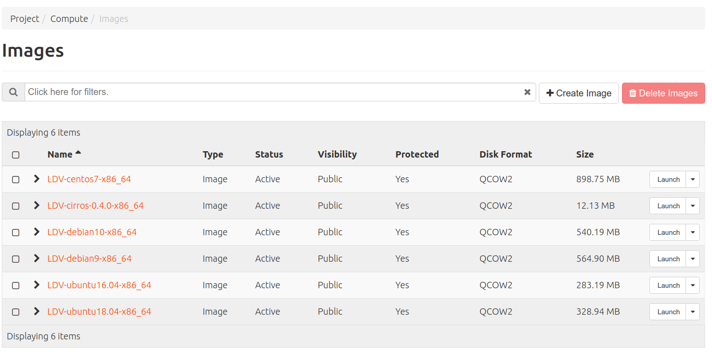

Lo habitual en un IaaS es que existan un conjunto de imágenes genéricas (*cloud-images*) y públicas (accesibles por todos los usuarios) para poder crear instancias. Además, cada usuario podrá crear y subir sus propias imágenes en función de los permisos y cuotas que se le hayan otorgado.

## **Sabores (o tipos de instancias)**

- Un sabor ( o tipo de instancia) es una plantilla que permite definir para una instancia una seríe de características hardware: el  número de CPUs virtuales (VCPUs), la memoria RAM y si dispone o no de discos efímeros y su tamaño.
- En OpenStackLDV existen varios sabores predeterminados.
- Es responsabilidad del administrador gestionar los sabores.

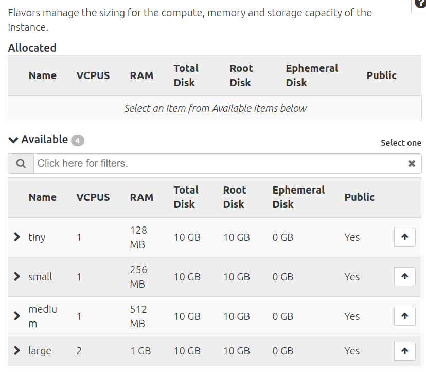

## **Instancias**

- El componente de OpenStack que gestiona la instancias es **Nova**.
- Una instancia es una máquina virtual aprovisionada por OpenStack.

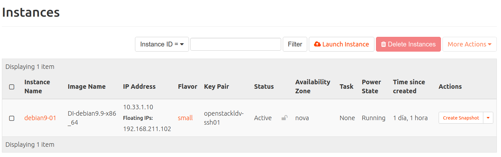

- Se crea (lanza) a partir de una imagen y en base a un sabor.
- Es capaz de configurarse dinámicamente en tiempo de instanciación gracias a un servicio del cloud denominado servidor de metadatos que "inyecta" o envía parámetros (nombre, IPs, claves SSH, scripts, ...) a las instancia.
- Cada instancia se ejecuta en uno de los nodos de computación del cloud.
- Se puede conectar a una o varias redes.

## **Redes y dispositivos de red**

El componente de OpenStack que gestiona las redes y los dispositivos de red es **Neutron**.

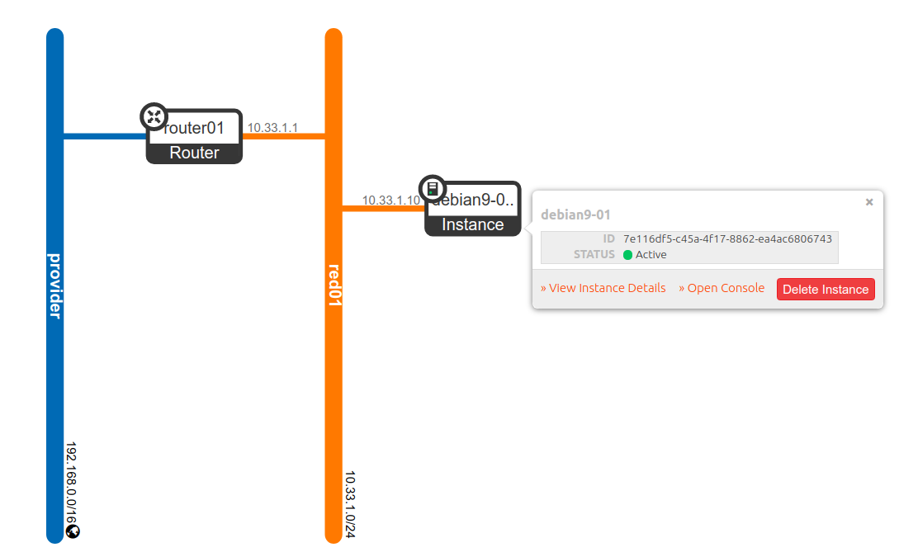

### Redes

- OpenStack permite crear permite crear redes virtuales.
- A esa redes se pueden conectar instancias y routers.
- Una red es un dominio de capa 2 (equivalente a una VLAN en redes físicas).
- Cada red esta "reservada" y es privada al proyecto en el que se crea.
- En OpenStackLDV existe una red especial (externa) creada que se denomina *provider*, que es equivalente a la red del instituto. No es posible conectar directamente instancias a la red *provider*.

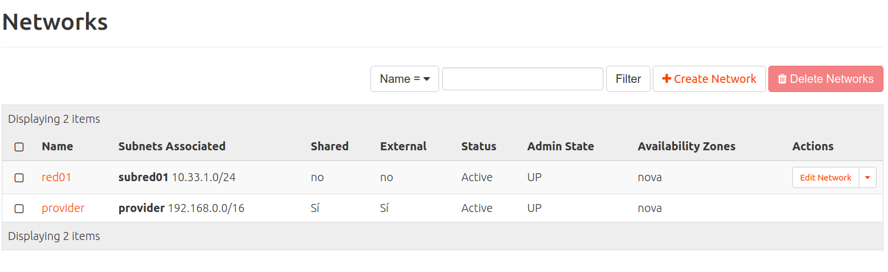

### Subredes

- Una subred es un bloque de direcciones IPv4 o IPv6 que se asignan a las instancias que se conectan a ella.
- Cada subred debe estar asociada a una red.
- OpenStack permite crear un servidor DHCP para otorgar la configuración de red a las instancias de forma dinámica.
- Múltiples subredes no contiguas pueden asociarse a una única red.

### Routers

- Dispositivos virtuales que permiten enrutar entre redes.
- Disponen de interfaces conectados a redes a los que se les pueden asignar IPs.

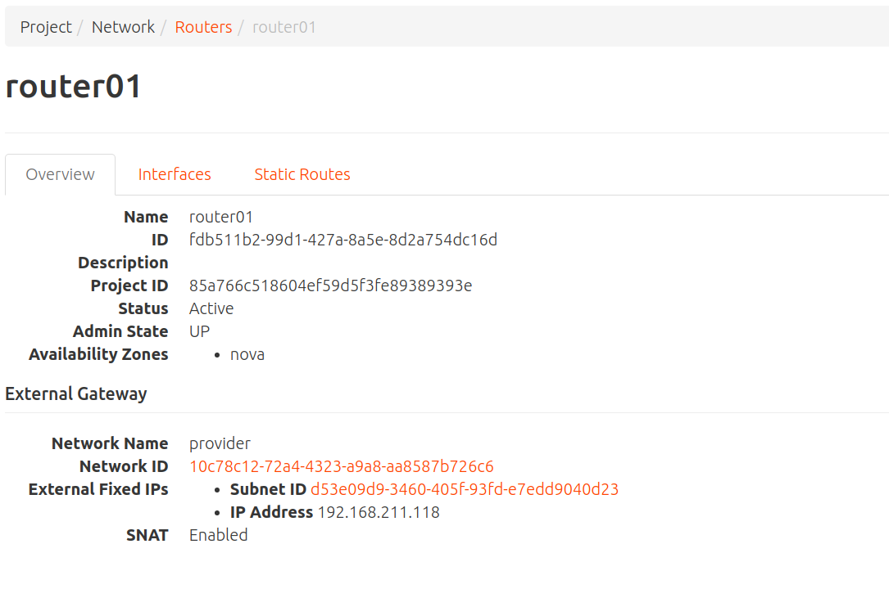

### Puertos

- Puerto virtual de un "switch virtual" que conecta a todos los dispositivos conectados a una red. Un punto de conexión para mapear la NIC de una instancia/interfaz de un router a una red virtual. Incluye la configuración de red asociada, como la MAC y la IP.
- Existe puertos a los que se conectan routers, instancias y servidores DHCP.

### IP Fija

- Dirección IP asignada a un interfaz de una instancia/router y que se utiliza para comunicación interna.
- La dirección IP fija no cambia durante la vida de la instancia.

### IP Flotante

- Dirección IP asociada a una instancia en un momento dado para poder acceder a ella desde el exterior.
- En OpenStackLDV el rango de IPs flotates es una rango de direcciones IPv4 de la red IP del instituto (la red *provider*).
- Una IP flotante puede desasignarse y asignarse a otra instancia diferente cuando se considere.
- Se asigna de forma dinámica a una instancia por DHCP.
- Una instancia ignora por completo que tiene dicha dirección.

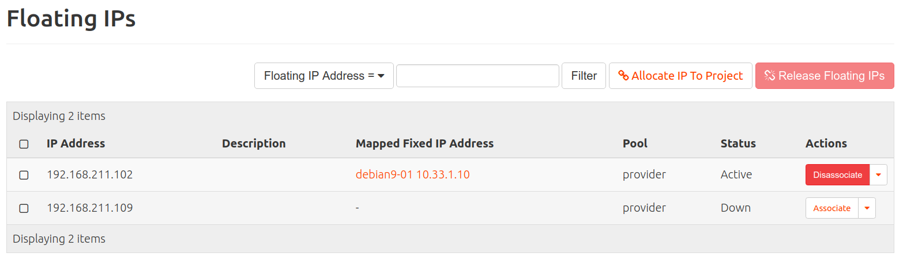

### Grupo de seguridad

- Reglas de cortafuegos que controlan el acceso a las instancias.
- Los grupos de seguridad permiten aplicar reglas de firewall por instancia (las reglas se aplican a nivel de interfaz de red).
- Soportan reglas de tráfico *ingress* y *egress*.
- Se puede cambiar de grupo de seguridad en vivo (con la instancia ejecutándose).
- Toda instancia debe pertenecer al menos a un grupo de seguridad y puede pertenecer a varios.
- En cada proyecto hay creado un grupo de seguridad por defecto (*default*) que permite intercomunicar a las instancias del proyecto .Por defecto permite todo el tráfico de salida y acepta tráfico *ingress* del grupo, pero rechaza todo el tráfico exterior que no proceda del grupo de seguridad *default*.

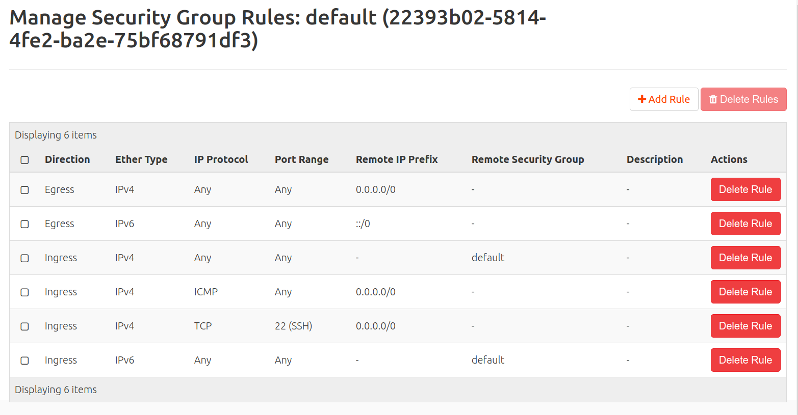

## **Claves SSH**

- Es habitual que las imágenes este preparadas para que a las instancias que se crean a partir de ellas solo de pueda acceder por SSH usando auntenticación por clave pública (la usuarios creados no tienen contraseña y el acceso usuario/clave está deshabilitado en el servidor SSH).
- Los usuarios pueden:
    - Crear pares de claves pública/privada en el cloud de forma que el usuario se descargará la clave privada en el equipo en el que usará el cliente SSH.
    - Subir la clave pública, asociada con una clave privada que haya creado previamente en su equipo, al cloud. Esta opción es más segura.

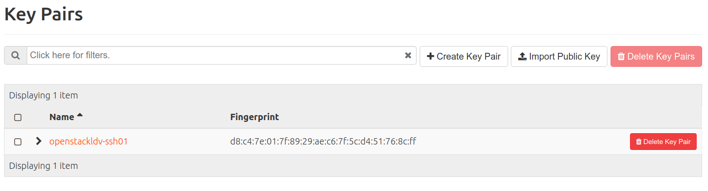

- En el momento de crear la instancia se puede indicar que clave/s pública/s se "inyectarán" en la instancia.
- Hay imágenes donde si esta habilitado el acceso usando usuario y contraseña (por ejemplo en Cirros).

## **Acciones sobre instancias**
Una vez creadas es posible realizar diferentes **operaciones o acciones** sobre una instancia.

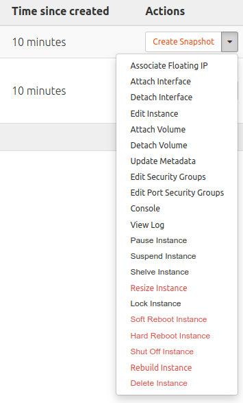

### Acciones sobre a la información de la instancia

- ***Editar instancia***: Permite cambiar el nombre de la instancia.
- ***View log***: Permite  acceder al log de inicio de la instancia.
- ***Console***: Permite acceder a una  **consola VNC** para administrar la instancia.
- ***Update metadatos***: Permite modificar los metadatos de la instancia.

###  Acciones sobre la configuración de red 

- ***Assocate Floating IP***: Permite asociar a la instancia una IP flotante reservada en el proyecto.  Consulta el apartado sobre [**Redes y dispositivos de red**.](#redes-y-dispositivos-de-red)
- ***Attach  Interface***: Permite añadir un nuevo interfaz (tarjeta) de red y conectarla a una red (internamente se crea un nuevo puerto). Consulta el apartado sobre [**Redes y dispositivos de red**.](#redes-y-dispositivos-de-red)
- ***Deattach  Interface***: Permite quitar un interfaz (tarjeta) de red y desconectarla por lo tanto de la red correspondiente. Consulta el apartado sobre [**Redes y dispositivos de red**.](#redes-y-dispositivos-de-red)

### Acciones sobre el ciclo de vida de la instancia

- ***Pause Instance***: Para la ejecución de la instancia guardando su estado en memoria RAM.
- ***Suspended Instance***: Para la ejecución de la instancia guardando su estado en memoria disco.
- ***Resume Instance***: Reaunda una instancia  suspendida o pausada.
- ***Shut Off Instance***: Apaga una instancia.
- ***Start Instance***: Inicia una instancia apagada.
- ***Soft Reboot***: envía una señal de reinicio al sistema operativo de la instancia.
- ***Hard Reboot***: fuerza el reinicio de la instancia. Solo deberíamos hacerlo si tenemos algún problema con ella.
- ***Lock Instance***:  Bloquea la instancia par que no se  pueda modificar su configuración.
- ***Unlock Instance***:  Desbloquea la instancia par que no se  pueda modificar su configuración. 
- ***Delete Instance***: Borra la instancia y libera todos los recursos que usaba.

### Acciones sobre el almacenamiento de la instancia

- ***Attach Volume***:  Permite conectar a la instancia un volumen previamente creado. Consulta el apartado sobre [**Almacenamiento**](#almacenamiento).
- ***Deattach Volume***: Permite desconectar de un volumen de la instancia. Consulta el apartado sobre [**Almacenamiento**](#almacenamiento)..
- ***Create Snapshot***: Permite crear una nueva *snapshot*. Consulta el apartado sobre [***Snapshots* de instancias**](#snapshots-de-instancias)

### Acciones sobre la configuración de la seguridad de la instancia

- ***Edit Security Groups***: Permite añadir o quitar grupos de seguridad. Consulta el apartado sobre [**Redes y dispositivos de red**.](#redes-y-dispositivos-de-red).
- ***Edit Port Security Groups***: Permite configurar la seguridad de un determinado puerto. Permite  desactivar el cortafuegos de la instancia en esa interfaz de red desactivando la opción **Seguridad del puerto**. Consulta el apartado sobre [**Redes y dispositivos de red**.](#redes-y-dispositivos-de-red).


### Redimensionar una instancia

- ***Resize Instance***: Permite cambiar el sabor de la instancia y por lo tanto sus recursos de CPU, RAM y disco. Se realiza en dos pasos, en primer lugar verifica si es posible llevarlo a cabo,  y si es posible la instancia pasa al estado VERIFY_RESIZE y se le pregunta al si Confirmar la redimensión o Revertir la redimensión.

### Reconstruir una instancia
- ***Rebuild Instace***: Permite reconstruir de nuevo la instancia usando **otra imagen** pero manteniendo la misma IP y metadatos..

### Archivar una instancia

- ***Shelve Instance***: **Archivar** una instancia permite detener una instancia y liberar en el cloud  los recursos de computación asociados ( vCPUs, RAM, disco) sin tener que eliminarla. Internamente se crea una instantánea (*snapshot*) de la instancia. La instancia en ejecución se elimina del nodo de computación, pero sus detalles del tiempo de ejecución,  vCPUs, RAM tamaño del disco y direcciones IP, se conservan.  Sobre una instancia archivada podemos eliminarla  o recuperarla.
- ***Unshelve Instance***: Permite recuperar una instancia **Archivada**.

## ***Snapshots* de instancias**

- Una snapshot es una instantanea de una instancia.
- Cuando se crea una *snapshot* de una instancia se crea una nueva imagen con el estado actual de la instancia.
- A partir de esta nueva imagen se pueden crear nuevas instancias. Esto es muy útil para distribuir imágenes con una configuración específica.

## **Almacenamiento**

OpenStack permite gestionar varios tipos de almacenamiento que podemos clasificar en:

- **Almacenamiento efímero**
    - Este almacenamiento está asociado al ciclo de vida de vida de una instancia. Cuando se destruye la instancia se borra el almacenamiento.
    - Lo ideal es crear siempre las instancias con almacenamiento efímero.
    - Terminar (destruir) una instancia es el borrado definitivo de la instancia !!! Miedo razonable a perder
    una instancia ¡¡¡ Cambio de mentalidad, lo que meta en la instancia debe ser efímero. Lo “importante” debe estar en el ​ Almacenamiento persistente (Volúmenes).

- **Almacenamiento persistente**
    - Almacenamiento independiente de la vida de las instancias.
    - Existen diferentes tipos de almacenamiento persistente soportados por diferentes componentes de OpenStack.

    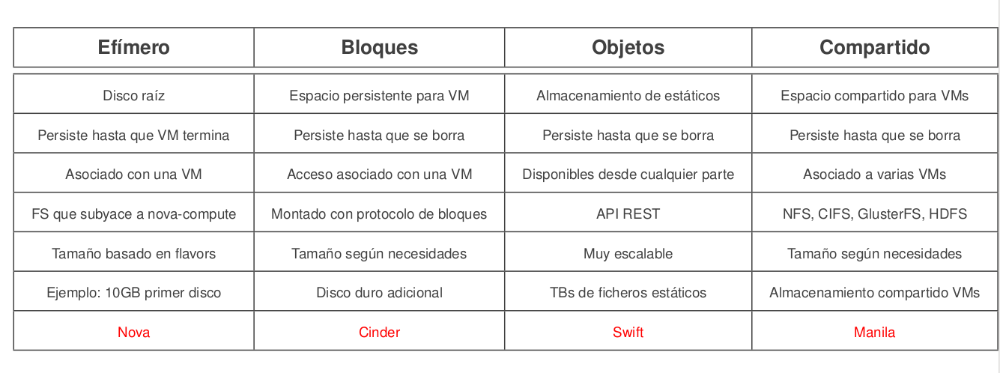
        Fuente: [https://flossystems.com/](https://flossystems.com/)

    - En OpenStackLDV está se dispone del almacenamiento de bloques basado en volúmenes gestionado por el componente
     **Cinder**.

### Volúmenes

- Un vólumen es un dispositivo de bloques que se puede asociar/desasociar de una instancia en cualquier momento.
- Utilizado para proporcionar almacenamiento persistente e independiente de la vida de una instancia.
- Pueden usarse también para arrancar instancias desde ellos.
- Un volumen solo puede estar asociado a una instancia simultáneamente.

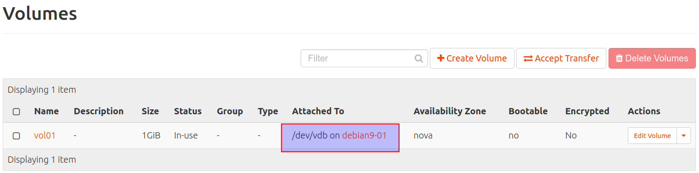

- En un IaaS no tiene utilidad y es obsoleto hacer particiones. Si necesito creo más volúmenes.
- Es importante asegurarse de formatear los volúmenes con sistemas de ficheros que admitan redimensión/reformateo en caliente.

### *Snapshots de volúmenes*

- Una *snapshot* es una copia instantánea de solo-lectura de un volumen en un momento determinado.
- Pueden usarse para crear nuevos volúmenes.
- Hay que tener cuidado con las *snapshots* de volúmenes en caliente.
- Las *snapshots* son dependientes del origen. Para borrar un volumen hay que borrar primero los *snapshots*
- Al crear un volumen a partir de *snapshot* de volumen lo independizamos el volumen del que inicia.

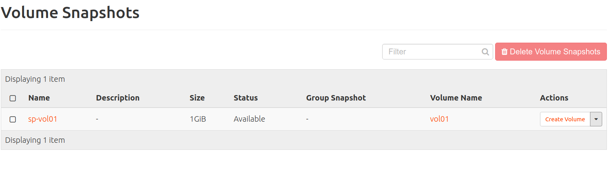

## **Servidor de metadatos y Cloud init**

- Recuerda que:
    - Una **instancia** es una máquina virtual aprovisionada por OpenStack que se crea (lanza) a partir de una **imagen** y en base a un **sabor** (plantilla con el tamaño - vCPUs, RAM y almacenamiento efímero-).
    - Una **imagen** es un sistema preconfigurado que se utiliza como base para crear instancias (máquinas virtuales).
  
- Las imagenes por lo tanto no tienen ninguna configuración específica y es necesario establecer una serie de configuraciones/parámetros en el momento de crear la instancia (nombre de la máquina,, usuarios, autenticación y claves ssh, ...).
- Opestack permite configurar las instancias dinámicamente en tiempo de
  instanciación gracias a un que ofrece un servicio del cloud denominado **servidor de metadatos** que "inyecta" o envía parámetros (nombre, IPs, claves SSH, scripts, ...) a las instancia.

### *Servidor de metadatos*

- Opestack (a través del compomete nova) ofrece usa un servicio especial de metadatos, que es accesible desde toda las instancia a través de la url
**<http://169.254.169.254/openstack>**.
- A partir de esa URL devuelve los metadatos al cliente que los solicita en formato **json**.
- Permite a las instancia inyectarse datos dinámicos sobre sí
misma para configurarse al arrancar por vez primera.
- Soporta API de Amazon EC2, lo que permite instanciar en OpenStack imágenes preparadas para Amazon.
- Ejemplos de consultas al servidor de metadatos desde una instancia.

```
curl -w"\n" 169.254.169.254
curl -w"\n" 169.254.169.254/latest/
curl -w"\n" 169.254.169.254/latest/meta-data
curl -w"\n" 169.254.169.254/latest/meta-data/hostname
curl -w"\n" 169.254.169.254/latest/meta-data/instance-type
curl -w"\n" 169.254.169.254/latest/meta-data/local-ipv4
curl -w"\n" 169.254.169.254/latest/meta-data/public-ipv4
```

### *Cloud-init*

- **Cloud-init** ([https://cloud-init.io/](https://cloud-init.io/)) es un software que permite consultar paramétros a un proveedor cloud o de virtualización para inicializar las instancias o máquinas virtuales duante su instanciación o arranque.

- Fue desarrollado inicialmente por Canonical para las imágenes cloud de Ubuntu usadas por AWS. Desde entonces, la aplicación ha evolucionado y puede ser usada en otras muchas distribuciones y en otros entornos cloud (y no cloud). Se ha convertido en el estandar y es soportado por múltiples sistemas operativos y proveedores de cloud y sistemas de virtualización.

- Durante el arranque, *cloud-init* identifica la nube/sistema en la que se está ejecutando e inicializa el sistema en consecuencia. Las instancias  se aprovisionarán automáticamente durante el primer arranque con redes, almacenamiento, claves SSH, paquetes y varios otros aspectos del sistema ya configurados.

- Las imágenes de **Openstack** (*cloud images*) tienen instalado y configurado el paquete *cloud-init* para inicializar las instancias. Puede consultar los datos desde diferentes fuentes (servidor de metadatos, *user-data*, ...) según la configuracion de *cloud-init*.

- Habitualmente cuendo se inicia o reinicia una instancia en Openstack *cloud-init* consulta el **servidor de metadatos** y:
   - Configura el hostname de la instancia.
    - Obtiene la información de la configuración de red. Si no existe, se hace una petición DHCP.
    - Genera par de claves SSH para la instancia.
    - Inyecta clave pública SSH en /.ssh/authorized_keys del usuario por defecto de la instancia
    - Configura locales por defecto.
    - Se redimensiona la partición raíz y los puntos de montaje del almacenamiento efímero de la instancia,
    - Consulta el **user-data**  inyectado por el usuario del cloud en tiempo de instanciación.

- Documentación de *cloud-init*: [https://cloudinit.readthedocs.io/en/latest/](https://cloudinit.readthedocs.io/en/latest/)

- **user-data**
    - Es un conjunto de datos/instrucciones que el usuario le puede indicar al cloud en el momento de crear o iniciar la instancia para que *cloud-init* los procese.
    - Soporta varios tipos de formato: <https://cloudinit.readthedocs.io/en/latest/explanation/format.html#user-data-formats>.     - En nuestras actividades vamos usar **scripts** y **cloud-config**.
      - **scripts**: en .sh, .bash, ....
      - **cloud-config**: fichero en formato YAML con una serie de directivas que permiten indicar acciones y datos.
    
- Ejemplos de **cloud-config**  

    - [Documentación oficial](https://cloudinit.readthedocs.io/en/latest/reference/examples.html).

    - [Documentación de RedHat](https://access.redhat.com/documentation/en-us/red_hat_enterprise_linux_atomic_host/7/html/installation_and_configuration_guide/setting_up_cloud_init).

Modificar el username del usuario por defecto
```
#cloud-config
system_info:
  default_user:
    name: alumno
```

Cambiar contraseña
```
#cloud-config
chpasswd:
  list: |
    alumno:alumno
  expire: False
```

Actualizar paquetes
```
#cloud-config
package_update: true
package_upgrade: true
package_reboot_if_required: false
```

Instalar paquetes
```
#cloud-config
packages:
  - traceroute
  - apache2
```

Escritura ficheros
```
#cloud-config
write_files:
  - path: /var/www/html/index.html
    permissions: '0644'
    owner: www-data:www-data
    content: |
      Mi web
```

runcmd:  Solo en el primer arranque
```
#cloud-config
runcmd:
  - rm -rf /var/www/html/
  - git clone https://github.com/asir/web-test.git /var/www/html/
  - chown -R www-data:www-data /var/www/html/
```

bootcmd: En cada arranque
```
#cloud-config
bootcmd:
  - rm -rf /var/www/html/
  - git clone https://github.com/asir/web-test.git /var/www/html/
  - chown -R www-data:www-data /var/www/html/
```


​      

- En **OpenStackLDV** es posible introducir el **user-data** en el momento de crear la instancia en la pestaña ***Configuration***.

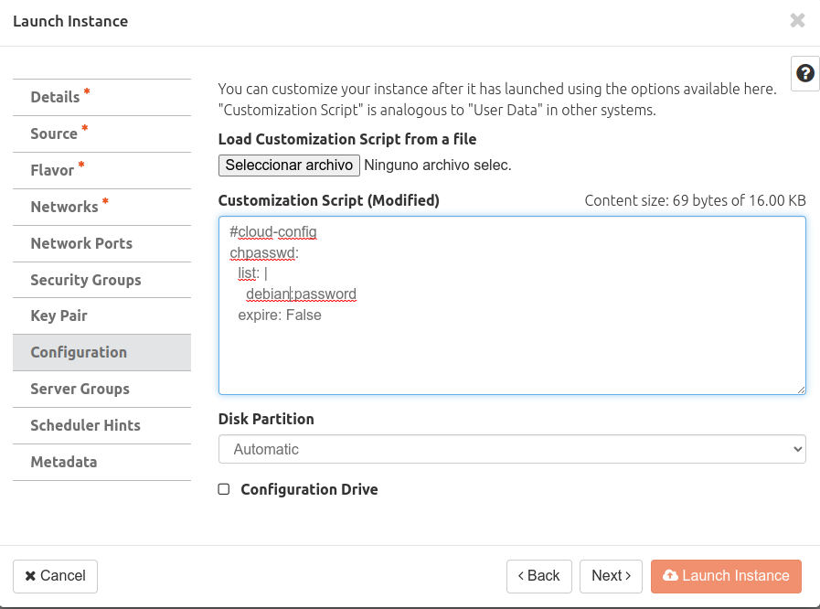