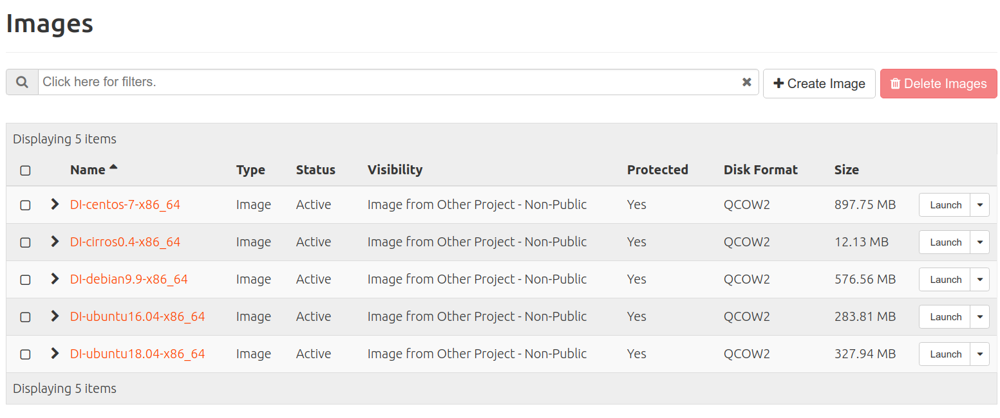
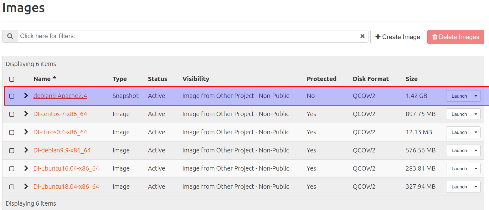

# Conceptos

Antes de empezar a utilizar los servicios de OpenStackLDV es necesario conocer su terminología y algunos conceptos importantes.

## **Imágenes**

- El componente de OpenStack que se gestiona las imágenes es **Glance**.
- Una imagen es un sistema preconfigurado que se utiliza como base para crear instancias (máquinas virtuales).
- Cada imagen es un fichero que contiene la estructura y contenidos completos de un dispositivo de almacenamiento
(HDD, CD, DVD, etc.).
- OpenStack soporta:
    - Múltiples formatos de imagen:
        - qcow2: Soportado por QEMU/KVM con múltiples opciones (snapshots, cifrado, compresión, expansión dinámica, ...) Es el formato que usaremos principalmente en OpenStackLDV.
        - raw: Formato de imagen de disco en crudo, desestructurado. No optimizado para virtualización pero muy portable.
        - iso: Un formato de ficheros para datos contenidos en un disco óptico, como por ejemplo un CD-ROM.
        - vmdk : Formato soportado por muchos hipervisores, principalmete VMware.
        - ak : Imagen con kernel de Amazon EC2.
        - ari: Imagen de disco en RAM de Amazon EC2.
        - vdi: Formato de imagen soportado por VirtualBox.
        - ...
    - Contenedores de imagen:
        - OVF: estándar abierto.
        - AMI: Una imagen de máquina Amazon, que precisa de una imagen aki y habitualmente de otra ari para poder arrancar.
- Cloud-images
    - Una *cloud-image* es una imagen preconstruida por una distribución.
    - Son discos arrancables, con el sistema operativo ya instalado y con datos específicos eliminados
(“anonimizada”).
    - Las principales “distros” libres las proporcionan ([OpenStack Get Images](https://docs.openstack.org/image-guide/obtain-images.html)).
    - El proyecto CirrOS nos ofrece imágenes de testing (¡no aptas para producción!).
    - Es posible crear nuestras propias *cloud-images* instalando nuestro sistema operativo y haciendo una serie de configuraciones.
    - Las imágenes son archivos de *solo lectura*.

Lo habitual en un IaaS es que existan un conjunto de imágenes genéricas (*cloud-images*) y públicas (accesibles por todos los usuarios) para poder crear instancias. Además, cada usuario podrá crear y subir sus propias imágenes en función de los permisos y cuotas que se le hayan otorgado.

## **Sabores (o tipos de instancias)**

- Un sabor ( o tipo de instancia) es una plantilla que permite definir para una instancia una seríe de características hardware: el  número de CPUs virtuales (VCPUs), la memoria RAM y si dispone o no de discos efímeros y su tamaño.
- En OpenStackLDV existen varios sabores predeterminados.
- Es responsabilidad del administrador gestionar los sabores.

## **Instancias**

- El componente de OpenStack que gestiona la instancias es **Nova**.
- Una instancia es una máquina virtual aprovisionada por OpenStack.

- Se crea (lanza) a partir de una imagen y en base a un sabor.
- Es capaz de configurarse dinámicamente en tiempo de instanciación gracias a un servicio del cloud denominado servidor de metadatos que "inyecta" o envía parámetros (nombre, IPs, claves SSH, scripts, ...) a las instancia.
- Cada instancia se ejecuta en uno de los nodos de computación del cloud.
- Se puede conectar a una o varias redes.

## ***Snapshots* de instancias**

- Una snapshot es una instantanea de una instancia.
- Cuando se crea una *snapshot* de una instancia se crea una nueva imagen con el estado actual de la instancia.
- A partir de esta nueva imagen se pueden crear nuevas instancias. Esto es muy útil para distribuir imágenes con una configuración específica.

## **Redes y dispositivos de red**

El componente de OpenStack que gestiona las redes y los dispositivos de red es **Neutron**.

### Redes

- OpenStack permite crear permite crear redes virtuales.
- A esa redes se pueden conectar instancias y routers.
- Una red es un dominio de capa 2 (equivalente a una VLAN en redes físicas).
- Cad red esta "reservada" y es privada al proyecto en el que se crea.
- En OpenStackLDV existe una red especial (externa) creada que se denomina *provider* que es equivalente a la red del instituto. No es posible conectar directamente instancias a la red *provider*.

### Subredes

- Una subred es un bloque de direcciones IPv4 o IPv6 que se asignan a las instancias que se conectan a ella.
- Cada subred debe estar asociada a una red.
- OpenStack permite crear un servidor DHCP para otorgar la configuración de red a las instancias de forma dinámica.
- Múltiples subredes no contiguas pueden asociarse a una única red.

### Routers

- Dispositivos virtuales que permiten enrutar entre redes.
- Disponen de interfaces conectados a redes a los que se les pueden asignar IPs.

### Puertos

- Puerto virtual de un "switch virtual" que conecta a todos los dispositivos conectados a una red. Un punto de conexión para mapear la NIC de una instancia/interfaz de un router a una red virtual. Incluye la configuración de red
asociada, como la MAC y la IP.
- Existe puertos a los que se conectan routers, instancias y servidores DHCP.

### IP Fija

- Dirección IP asignada a un interfaz de una instancia/router y que se utiliza para comunicación interna.
- La dirección IP fija no cambia durante la vida de la instancia.

### IP Flotante

- Dirección IP asociada a una instancia en un momento dado para poder acceder a ella desde el exterior.
- En OpenStackLDV el rango de IPs flotates es una rango de direcciones IPv4 de la red IP del instituto (la red *provider*).
- Una IP flotante puede desasignarse y asignarse a otra instancia diferente cuando se considere..
- Se asigna de forma dinámica a una instancia por DHCP.
- Una instancia ignora por completo que tiene dicha dirección.

### Grupo de seguridad

- Reglas de cortafuegos que controlan el acceso a las instancias.
- Los grupos de seguridad permiten aplicar reglas de firewall por instancia (las reglas se aplican a nivel de interfaz de red).
- Soportan reglas de tráfico *ingress* y *egress*.
- Se puede cambiar de grupo de seguridad en vivo (con la instancia ejecutándose).
- Toda instancia debe pertenecer al menos a un grupo de seguridad y puede pertenecer a varios.
- En cada proyecto hay creado un grupo de seguridad por defecto (*default*) que permite intercomunicar a las instancias del proyecto .Por defecto permite todo el tráfico de salida y acepta tráfico *ingress* del grupo, pero rechaza todo el tráfico exterior que no proceda del grupo de seguridad *default*.

## **Claves SSH**

- Es habitual que las imágenes este preparadas para que a las instancias que se crean a partir de ellas solo de pueda acceder por SSH usando auntenticación por clave pública (la usuarios creados no tienen contraseña y el acceso usuario/clave está deshabilitado en el servidor SSH).
- Los usuarios pueden:
    - Crear pares de claves pública/privada en el cloud de forma que el usuario se descargará la clave privada en el equipo en el que usará el cliente SSH.
    - Subir la clave pública, asociada con una clave privada que haya creado previamente en su equipo, al cloud. Esta opción es más segura.

- En el momento de crear la instancia se puede indicar que clave/s pública/s se "inyectarán" en la instancia.
- Hay imágenes donde si esta habilitado el acceso usando usuario y contraseña (por ejemplo en Cirros).

## **Almacenamiento**

OpenStack permite gestionar varios tipos de almacenamiento que podemos clasificar en:

- **Almacenamiento efímero**
    - Este almacenamiento está asociado al ciclo de vida de vida de una instancia. Cuando se destruye la instancia se borra el almacenamiento.
    - Lo ideal es crear siempre las instancias con almacenamiento efímero.
    - Terminar (destruir) una instancia es el borrado definitivo de la instancia !!! Miedo razonable a perder
una instancia ¡¡¡ Cambio de mentalidad, lo que meta en la instancia debe ser efímero. Lo “importante” debe estar en el ​ Almacenamiento persistente (Volúmenes).

- **Almacenamiento persistente**
    - Almacenamiento independiente de la vida de las instancias.
    - Existen diferentes tipos de almacenamiento persistente soportados por diferentes componentes de OpenStack.

    
        Fuente: [https://flossystems.com/](https://flossystems.com/)

    - En OpenStackLDV está se dispone del almacenamiento de bloques basado en volúmenes gestionado por el componente
     **Cinder**.

### Volúmenes

- Un vólumen es un dispositivo de bloques que se puede asociar/desasociar de una instancia en cualquier momento.
- Utilizado para proporcionar almacenamiento persistente e independiente de la vida de una instancia.
- Pueden usarse también para arrancar instancias desde ellos.
- Un volumen solo puede estar asociado a una instancia simultáneamente.

- En un IaaS no tiene utilidad y es obsoleto hacer particiones. Si necesito creo más volúmenes.
- Es importante asegurarse de formatear los volúmenes con sistemas de ficheros que admitan redimensión/reformateo en caliente.

### *Snapshots de volúmenes*

- Una *snapshot* es una copia instantánea de solo-lectura de un volumen en un momento determinado.
- Pueden usarse para crear nuevos volúmenes.
- Hay que tener cuidado con las *snapshots* de volúmenes en caliente.
- Las *snapshots* son dependientes del origen. Para borrar un volumen hay que borrar primero los *snapshots*
- Al crear un volumen a partir de *snapshot* de volumen lo independizamos el volumen del que inicia.

