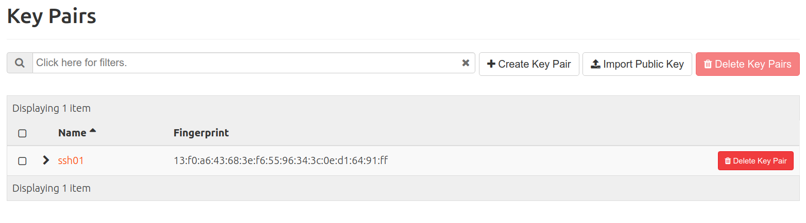
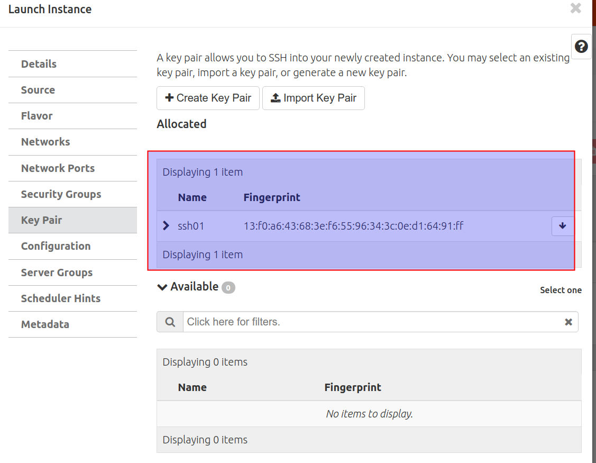
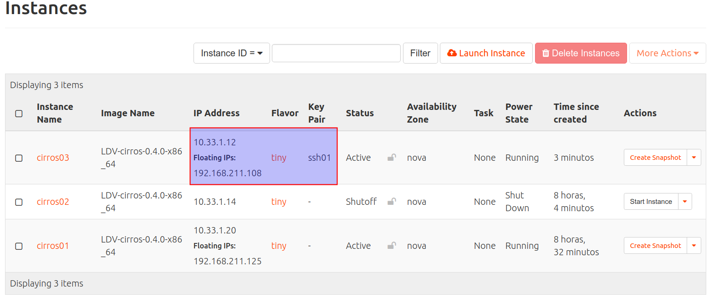
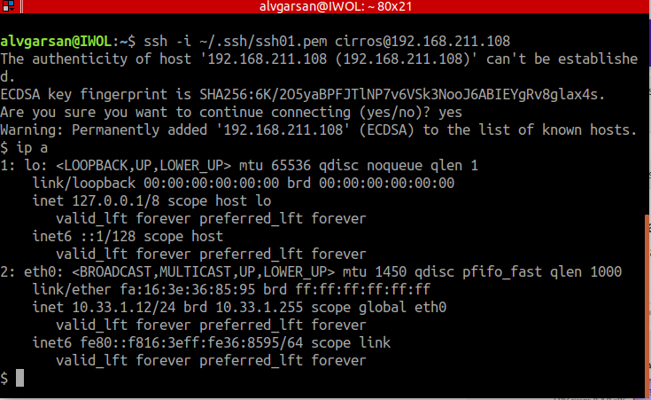

# Claves SSH
## Introducción
En esta actividad vamos a:

- Crear un par de claves SSH y descargar la clave privada.
- Crear otra instancia similar a las que has creado en actividades anteriores e inyectar la clave pública del par de claves creado.
- Establecer una conexión SSH con la instancia autenticándose por clave pública.

Consulta información sobre **claves SSH** en la sección [Conceptos](../../../09-Conceptos/Conceptos.md#claves-ssh).

## Configuración

Accede a Horizon e Inicia sesión con tu usuario y contraseña.

Accede a  ***Project, Compute, Key Pairs***.

Pincha en ***Create Key Pair***  para crear un par de claves con el nombre **ssh01**. Observa que se descarga la clave privada (el cloud no almacena la clave privada, por eso se puede descargar).


Crea una nueva instancia con el nombre **cirros03** inyectando la clave pública del par de claves que has creado. Para ello en el momento de la creación (como has hecho en actividads anteriores) en la sección ***Key Pairs***  selecciona la clave **ssh01**. 


Asígnale una IP flotante a la instancia y verifica que existe la regla para permitir el acceso SSH en el grupo de seguridad *default*.


Copia la clave privada descargada en el directorio **.ssh** del directorio home de tu usuario (~./ssh).

Dale permisos restrictivos (600) a la clave privada.

```chmod 600 ~/ssh01.pem```

Establece la conexión SSH y observa que no se pide la contraseña.

 	ssh -i ~/ssh01.pem cirros@ipflotante



En el siguiente [enlace](https://creodias.eu/faq-openstack/-/asset_publisher/TpmSvaqp3CVd/content/how-to-access-vm-from-windows-putty-?inheritRedirect=true) puedes ver como conectarte usando Putty como cliente. 