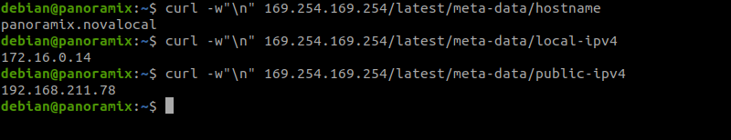
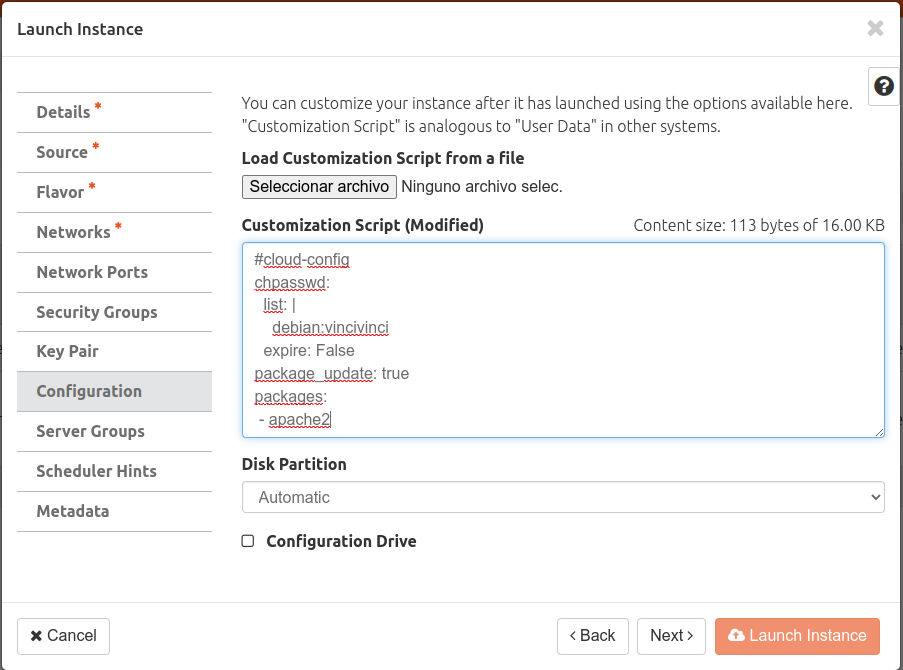

# Cloud Init

## Introducción

En esta actividad vamos a:

- Consultar el **servidor de metadatos** desde una instancia.
- Crear nuevas instancias indicando configuraciones de tipo **user-data**  en formato  **cloud-config** para que sean leídas y aplicadas por **cloud-init**.


Consulta información sobre **servidor de metadatos** y **cloud-init** en la sección [Conceptos](../../../09-Conceptos/Conceptos.md#servidor-de-metadatos-y-cloud-init).

## Configuración 

### Servidor de metadatos

Accede a Horizon e Inicia sesión con tu usuario y contraseña.

Accede por ssh a la instancia **panoramixXX** que creaste en la actividad anterior.

Pruebas las siguientes consultas al servidor de metadatos.

```
curl -w"\n" 169.254.169.254
curl -w"\n" 169.254.169.254/latest/
curl -w"\n" 169.254.169.254/latest/meta-data
curl -w"\n" 169.254.169.254/latest/meta-data/hostname
curl -w"\n" 169.254.169.254/latest/meta-data/instance-type
curl -w"\n" 169.254.169.254/latest/meta-data/local-ipv4
curl -w"\n" 169.254.169.254/latest/meta-data/public-ipv4
```


### Cloud-init

Borra la instancia **panoramix**.

Ahora vamos a configura un **user-data** en formato **cloud-config ** que realice las siguientes configuraciones sobre una nueva instancia de debian que vamos a crear.

- Asignará una clave al usuario **debian**.
- Realizará un **apt update**.
- Instalará el paquete **apache2**.

Crea en tu equipo un fichero con el nombre **cloud-config.yaml** con el siguiente contenido y  crea de nuevo la instancia **panoramix** (con las mismas características que antes) y antes de lanzaría accede en la pestaña ***Configuration*** selecciona el archivo **cloud-config.yaml**.
```
#cloud-config
chpasswd:
  list: |
    debian:vincivinci
  expire: False
package_update: true
packages:
 - apache2
```


Espera un poco a que se realicen todas las operaciones (en actualizar paquetes e instalar apache tarda un poco).

Puedes pinchar sobre  el nombre de la instancia, acceder a la pestaña **Logs** y posteriormente a **View Full Log** para ver las tareas que hace **cloud-init**. Si hay algún error de sintaxis en el **cloud-config** aquí lo podrás ver.

Asígnale una IP flotante y el grupo de seguridad adecuado.	

Comprueba que ahora puedes iniciar sesión con el usuario **debian** y contraseña **vincivinci**.

Verifica que se ha instalado **apache**.
