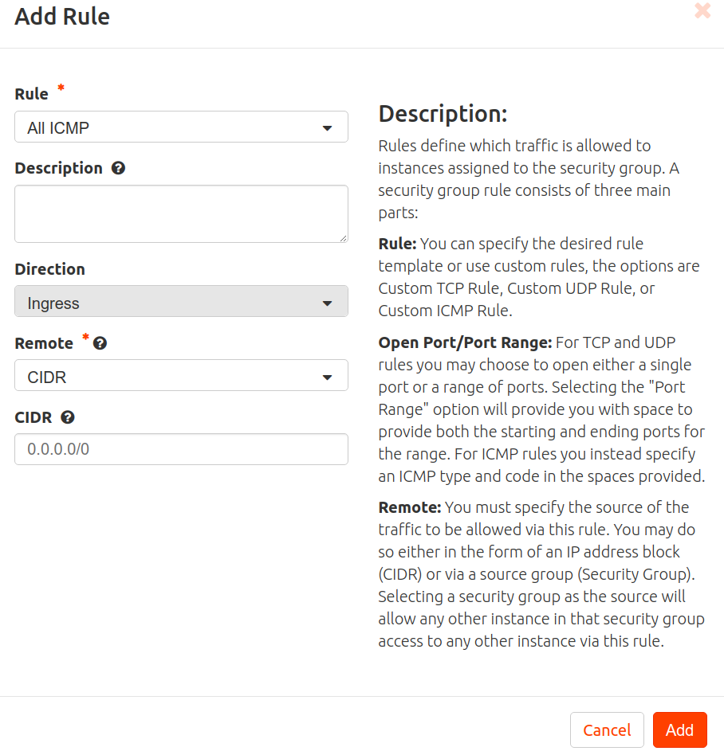
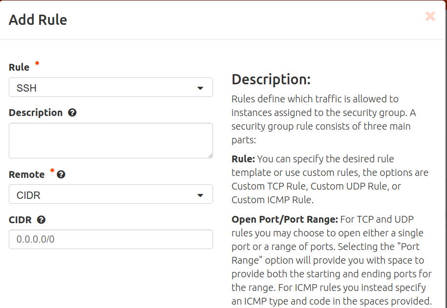

# IPs flotantes y grupos de seguridad
## Introducción
En esta actividad vamos a:

- Asociar una **IP flotante** a una de las instancias que has creado para poder acceder desde el exterior (red del instituto).
- Crear una nueva regla en el **grupo de seguridad** ***default*** para poder hacer ping a las instancias que pertenezcan a este grupo.
- Verificar que es posible hacer ping a la IP pública de la instancia.
- Crear una nueva regla en el **grupo de seguridad** ***default*** para poder acceder por SSH a las instancias que pertenezcan a este grupo. 
- Establecer una conexión SSH con la instancia.

Consulta información sobre **ips fijas** e **ips flotantes** en la sección [Conceptos](../../../09-Conceptos/Conceptos.md#ip-fija).

Consulta información sobre **grupos de seguridad** en la sección [Conceptos](../../../09-Conceptos/Conceptos.md#grupo-de-seguridad).

## Configuración
### IP Flotantes

Accede a Horizon e Inicia sesión con tu usuario y contraseña.

Accede a ***Project, Compute, Instances***. Pincha sobre ***Start Instance*** en **cirros01** para iniciar la instancia.

Accede a ***Project, Compute, Network, Floating IPs***.

Haz clic sobre ***Allocate IP to Project*** para reservar una IPs flotante. Estás IPs en un cloud público serían direcciones de Internet. En nuestro caso son direcciones de la **red provider (192.16.0.0/16)**, la red del instituto.


Accede a ***Compute, Project, Instances***. En la instancia **cirros01** accede a ***Actions, Associate  Floating IP***. Selecciona la IP flotante a asociar el interfaz de red de la instancia con la que se asocia. Pincha en ***Associate***.

Observa la IP asociada.


Abre un terminal en tu equipo y haz un ping a la IP flotante.

Observa que no responde.


### Grupos de seguridad

Accede a  ***Project, Network, Security Groups***.

Observa las reglas del grupo ***default*** (por defecto permite todo el tráfico de salida y acepta tráfico *ingress* del grupo, pero rechaza todo el tráfico exterior que no proceda del grupo de seguridad *default*).

Sobre el grupo ***default*** pincha en ***Manage Rules***.

Pincha en **Add Rule** y crea una regla para permitir **el tráfico ICMP de entrada desde cualquier sitio**.



Abre un terminal en tu equipo y haz un ping a la IP flotante y observa que ahora sí responde.


Pincha en **Add Rule** y crea una regla para permitir **el tráfico SSH de entrada desde cualquier sitio**.



Abre un terminal y establece una conexión SSH con la instancia cirros01..

```ssh cirros@ip_flotante```

