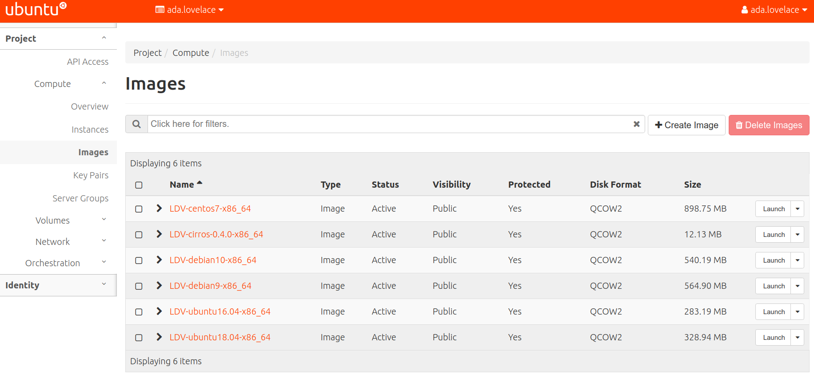
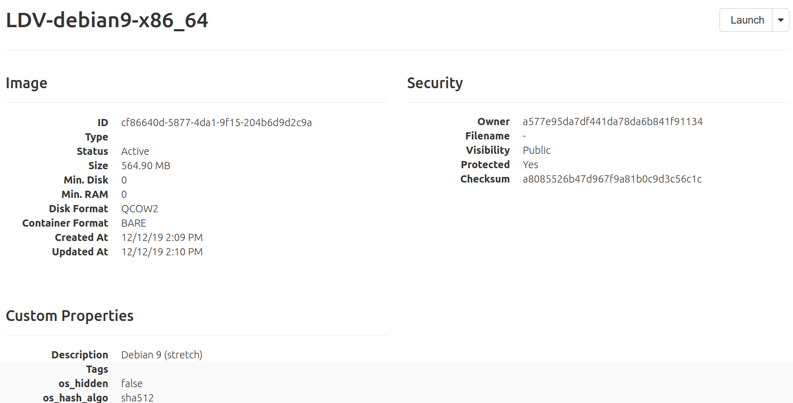

# Imágenes públicas
## Introducción
En está actividad vamos a consultar las imágenes públicas disponibles en **OpenStackLDV**.

Recuerda que una imagen es un sistema preconfigurado que se utiliza como base para crear instancias (máquinas virtuales). Cada imagen es un fichero que contiene la estructura y contenidos completos de un dispositivo de almacenamiento (HDD, CD, DVD, etc.).

Puedes consultar más información sobre **imágenes** en la sección [Conceptos](../../../09-Conceptos/Conceptos.md#Imágenes).

Lo habitual en un IaaS es que existan un conjunto de imágenes genéricas (*cloud-images*) y públicas (accesibles por todos los usuarios) para poder crear instancias.

## Configuración

Accede a Horizon.

Inicia sesión con tu usuario y contraseña.

En el menú de la izquierda accede a ***Project, Compute, Images*** y observa las imágenes públicas disponibles.

Pincha sobre una de ellas y observa sus características.
