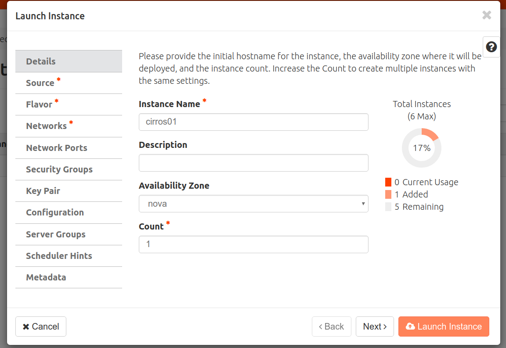
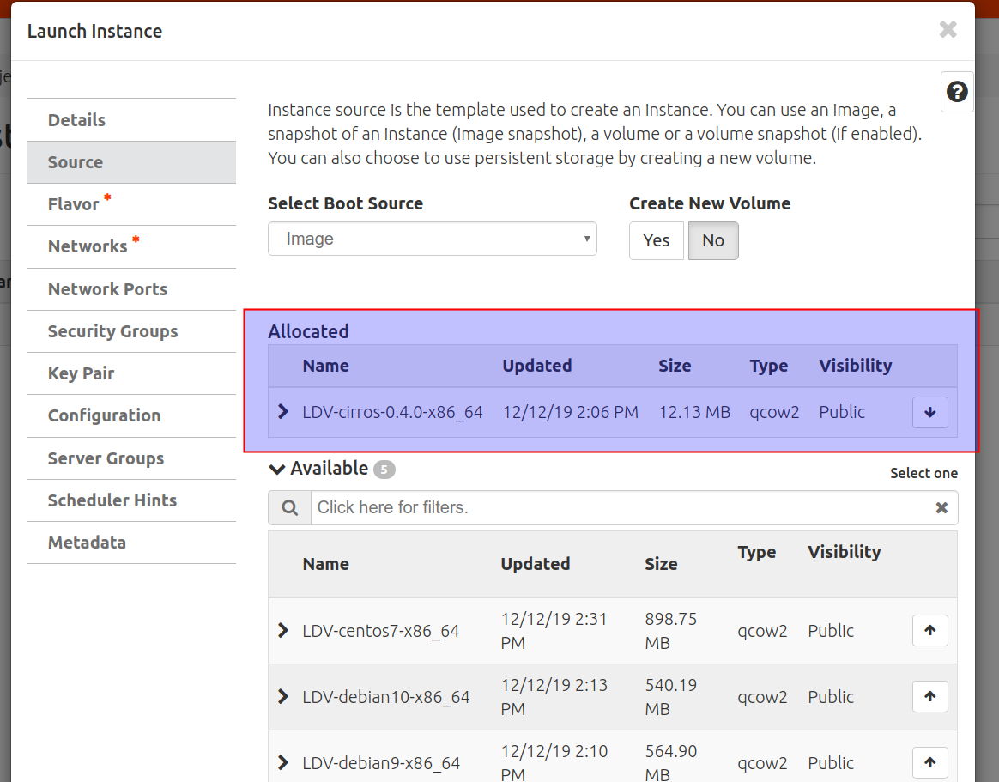
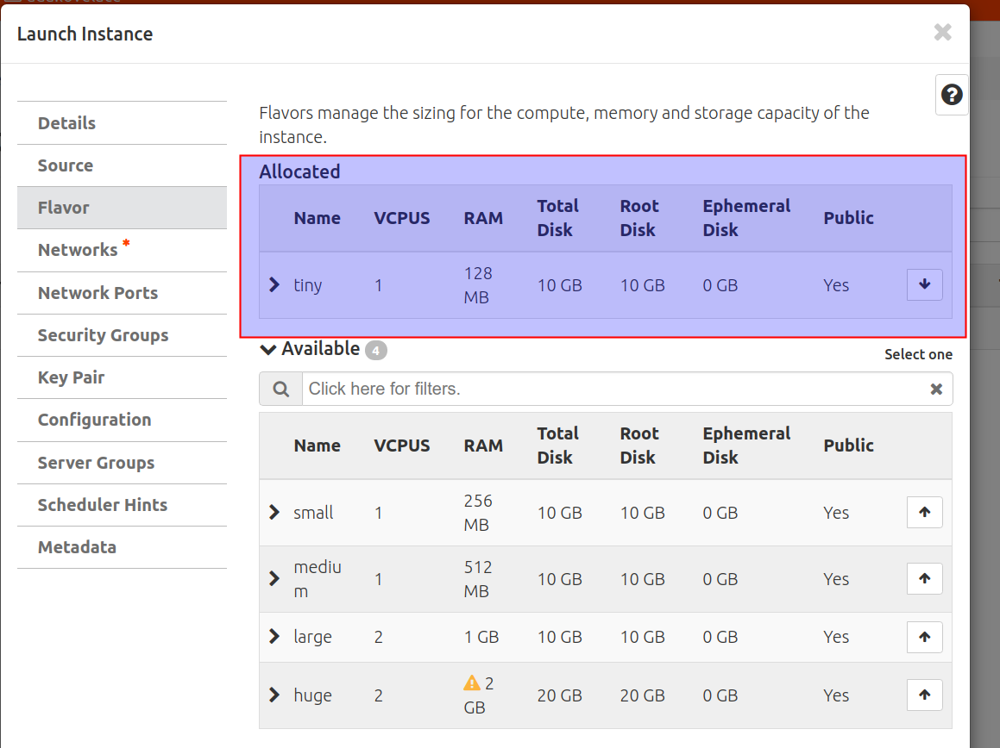
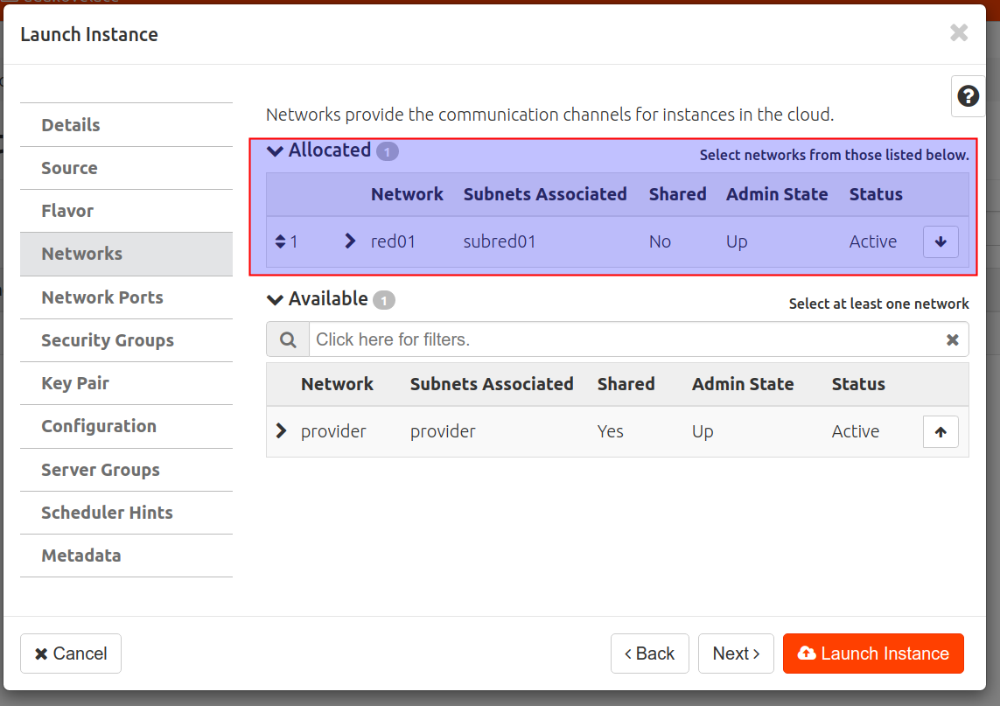
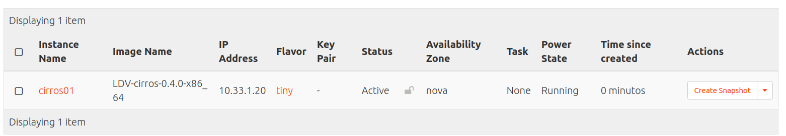
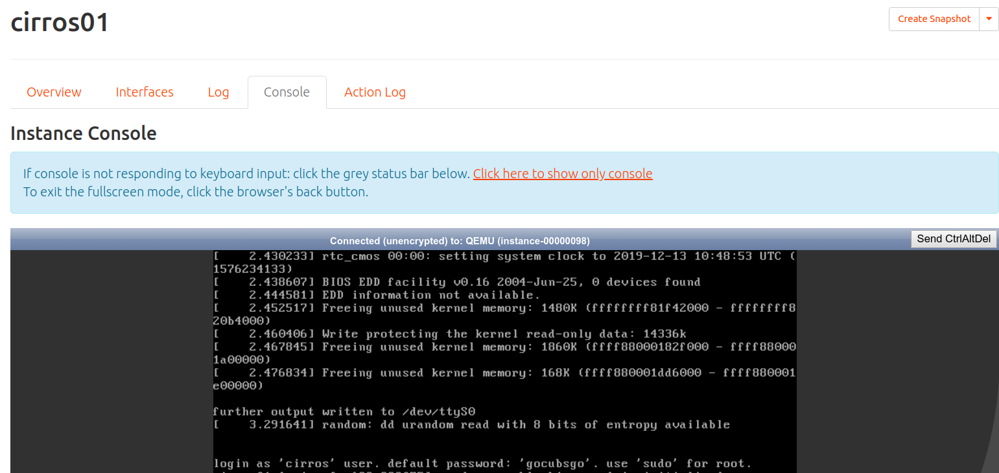
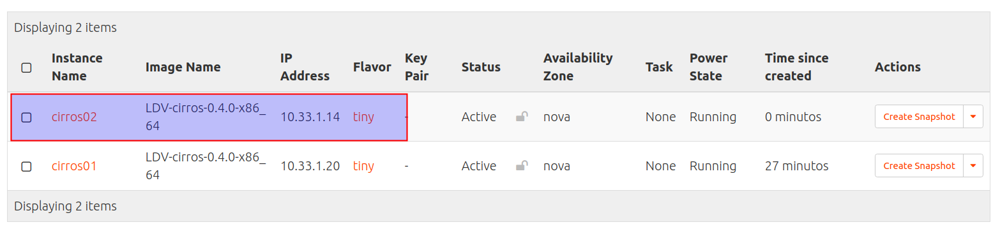
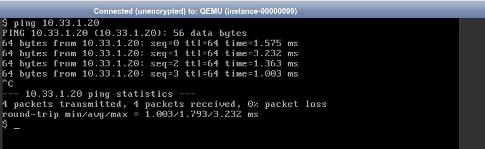

# Crear instancias
## Introducción

En esta actividad vamos a:

- Crear una instancia en tu proyecto a partir de sabor ***tiny*** usando la imagen de **CirrOS**.
- Conectar la instancia a la **red01** creada en la actividad anterior.
- Usar la consola VNC para acceder la instancia creada y verificar su configuración IP.
- Crear otra instancia similar y verificar que hay comunicación IP entre las instancias.

Consulta información sobre **sabores** en la sección [Conceptos](../../../09-Conceptos/Conceptos.md#sabores-o-tipos-de-instancias).

Consulta información sobre **instancias** en la sección [Conceptos](../../../09-Conceptos/Conceptos.md#instancias).

## Configuración

Accede a Horizon e Inicia sesión con tu usuario y contraseña.

Accede a ***Project, Compute, Instances***. Pincha en ***Lauch Instance***.
- Introduce el nombre **cirros01** y pincha en ***Next***.



- Selecciona la imágen pública de **CirrOS** para crear la instancia a partir de ella  y pincha en ***Next***.



 - Selecciona ***tiny*** como sabor y pincha en ***Next***.



- Selecciona la **red01** para conectar a ella la instancia y pincha en ***Next***.



- Pincha en ***Lauch Instance*** para crear la instancia (el resto de opciones disponibles se dejan com su valor por defecto, se tratarán en futuras actividads).

Observa las características de la instancia creada (imagen, sabor, estado, ...). Observa que la dirección IP asignada.


Accede a ***Project, Network, Network Topology*** y observa la topología de red. Observa donde está conectada la instancia.


Accede a ***Project, Compute, Instances***. Pincha sobre el nombre de la instancia **cirros01** y accede a la pestaña ***Console***. Abre en nueva pestaña la consola usado el enlace ***Click here to show only console***.


- Inicia sesión con el usuario **cirros** y la contraseña que indica **gocubsgo**.
- Consulta la IP de la máquina y verifica que tiene comunicación con la IP 10.33.1.1 (del router01).
  

- Haz ping a una dirección a una IP del instituto (por ejemplo 192.168.200.100) y verifica que no hay comunicación.
- Usa ```nslookup``` para resolver un nombre DNS y verificar que hay comunicación con Internet ya que el servidor DNS al que se pregunta es el 8.8.8.8.
  

Crea otra instancia similar con el nombre **cirros02** y verifica que hay comunicación IP entre las instancias. Tienes que seguir unos pasos simililares a los anteriores y verificar la IP de la nueva instancia.



Accede a ***Project, Network, Network Topology*** y verifica la topología de red creada.


En cada instancia accede a ***Actions*** (flecha hacía abajo), ***Shut Off Instance*** para apagar las instancias **cirros01** y **cirros02**.