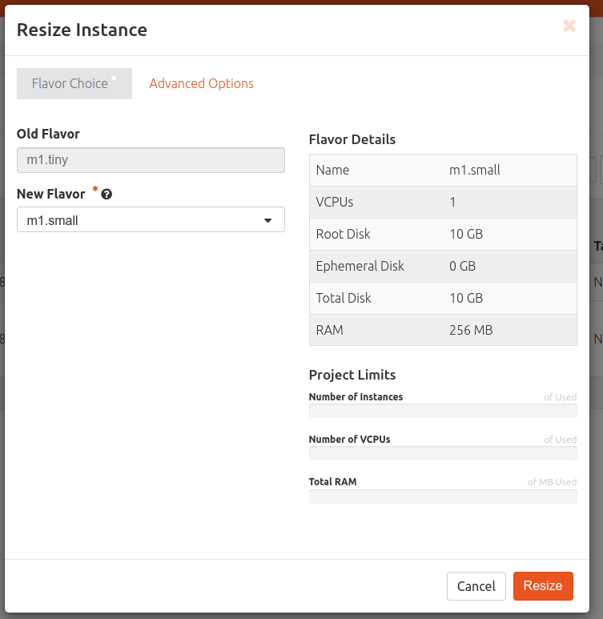
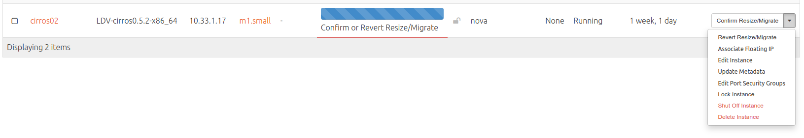
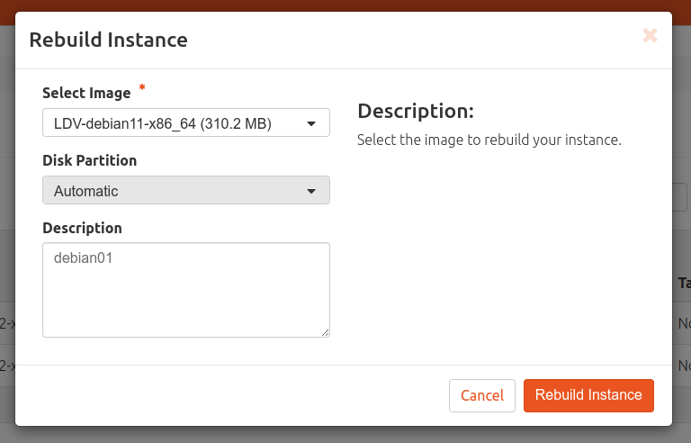
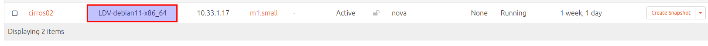
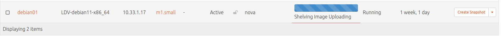
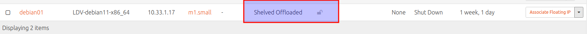
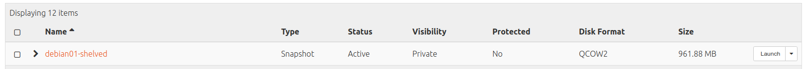

# Redimensión, reconstrución y archivado de instancias
## Introducción

En esta actividad vamos a:

- Redimensionar una instancia existente cambiando su sabor.
- Reconstruir una instancia existente.
- Archivar una instancia para liberar sus recursos.

Consulta información sobre **redimensionar** en la sección [Conceptos](../../../09-Conceptos/Conceptos.md#redimensionar-una-instancia).

Consulta información sobre **reconstruir** en la sección [Conceptos](../../../09-Conceptos/Conceptos.md#reconstruir-una-instancia).

Consulta información sobre **Archivar** en la sección [Conceptos](../../../09-Conceptos/Conceptos.md#archivar-una-instancia).

## Configuración

Accede a Horizon e Inicia sesión con tu usuario y contraseña.

### Redimensionar una instancia

Accede a las acciones de la instancia **cirros02** y selecciona ***Resize Instance***.

Selecciona como nuevo sabor **m1.small** y observa las nuevos recursos que tendrá la imagen. Pincha en ***Resize*** para aceptar.

.

En este momento OpenStack esta verificando si es posible llevarlo a cabo.  Si es posible la instancia pasa al estado VERIFY_RESIZE  y nos pregunta si Confirmar la redimensión o Revertir la redimensión.

Confirma la redimensión en ***Confirm Resize/Migrate*** y observa como el sabor ha cambiado.

### Reconstruir una instancia

Accede a las acciones de la instancia **cirros02** y selecciona ***Rebuild Instance***.

Selecciona como nuevo imagen **LDV-debian11** y cambia la descripción a **debian01**.  Pincha en ***Rebuild Instance*** para aceptar.

Observa como cambia la imagen de la instancia.

Cambia el nombre de la instancia a **debian01** (usando la opción ***Edit Instance***).

### Archivar una instancia

Accede a las acciones de la instancia **debian01** y selecciona ***Shelve Instance***. Espera a que termine el proceso.

Accede a ***Compute, Images*** y observa que se ha creado una ***snapshot*** de la instancia.

Accede a ***Compute, Instances*** y desarchiva la instancia usando la opción ***Unshelve Instance***.

Verifica el estado de la instancia es de nuevo ***Active*** y que se ha eliminado la ***snapshot***.

