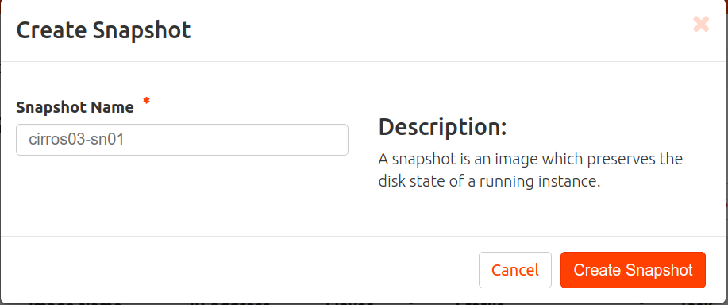
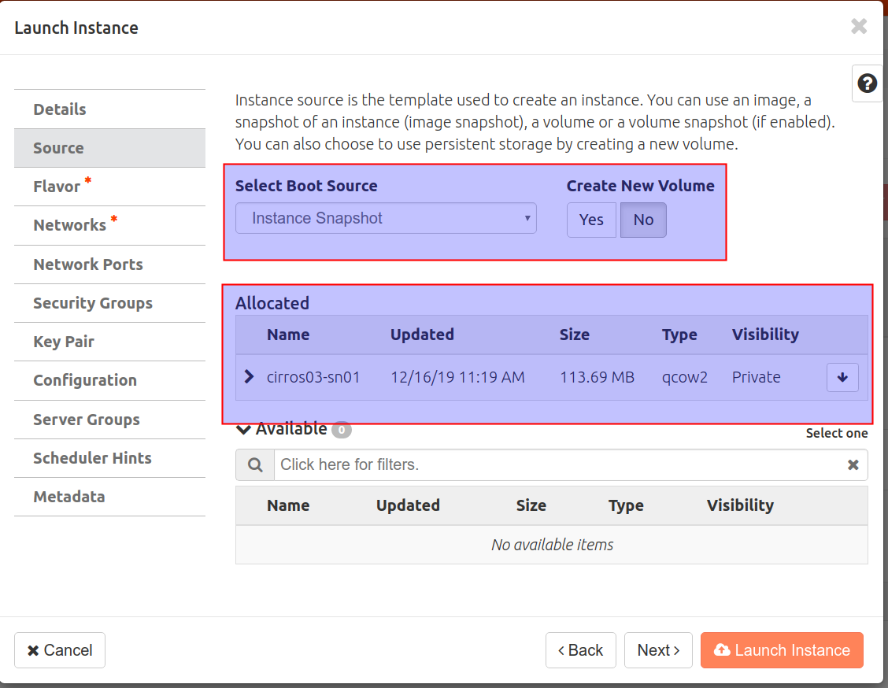

# Snapshots de instancias
## Introducción
En esta actividad vamos a:

- Acceder a una de las instancias existentes, crear un usuario nuevo y un fichero en el directorio home del nuevo usuario.
- Crear un snapshot de la instancia.
- Crea otra instancia similar a partir del snapshot.
- Acceder a la instancia creada y verificar que existen el fichero y el usuario.

Consulta información sobre **Snapshots** en la sección [Conceptos](../../../09-Conceptos/Conceptos.md#snapshots-de-instancias).

## Configuración

Accede a Horizon e Inicia sesión con tu usuario y contraseña.

Accede a  ***Project, Compute, Instances***. Inicia la instancia **cirros03**.

Inicia sesión en la máquina con el usuario **cirros03** a través de la consola o mediante una conexión SSH.

- Crea el usuario curso.

```sudo adduser fp```

- Inicia sesión con el usuario fp.

```su - fp```

- Crea el fichero hola.txt .
      ```touch curso.txt```
  

En el panel de administración web, sobre la instancia **cirros03** en la columna ***Actions*** pincha en ***Create Snapshot***.

Asígnale el nombre **cirros03-sn1** y pincha en ***Create Snapshot***.


Accede a  ***Project, Compute, Images*** y observa que la snapshot se ha almacenado como una imagen con visibilibiad ***Private*** (significa que solo es visible en tu proyecto).


Accede a ***Project, Compute, Instances***. Pincha en ***Lauch Instance*** y crea otra instancia con el nombre ***cirros04*** a partir de la snapshot creada. En el paso ***Source*** hay que selccionar como ***Select Boot Source*** la opción ***Instance Snapshot***.


Inicia sesión en **cirros04** y verifica que existen el archivo y el usuario creados.


Apaga la instancias **cirros03** y **cirros04**


