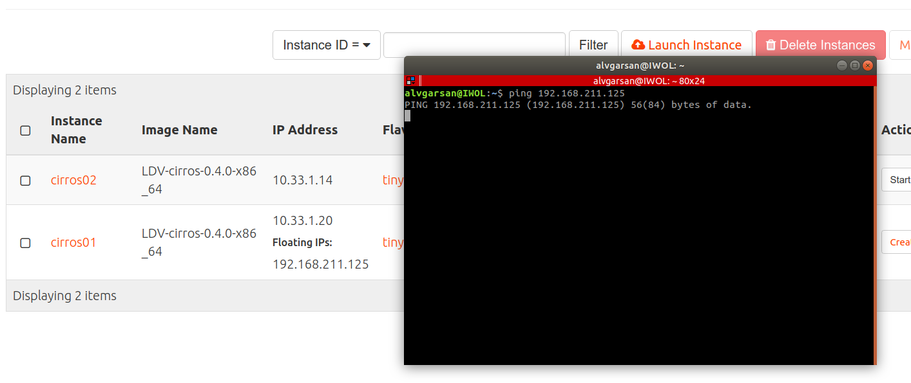
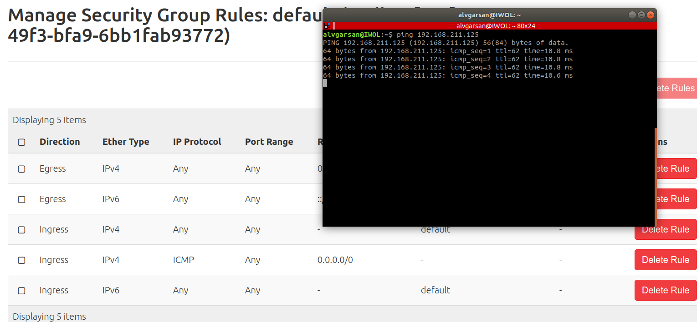
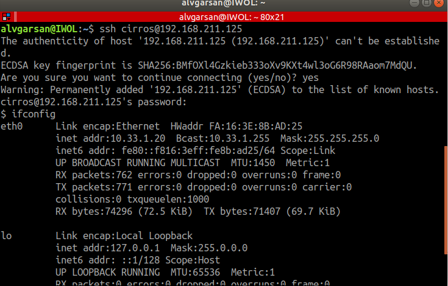

# IPs flotantes y grupos de seguridad-OSC
## Introducción
En esta actividad, usando *OpenStack Client*, vamos a:

- Asociar una **IP flotante** a una de las instancias que has creado para poder acceder desde el exterior (red del instituto).
- Crear una nueva regla en el **grupo de seguridad** ***default*** para poder hacer ping a las instancias que pertenezcan a este grupo.
- Verificar que es posible hacer ping a la IP pública de la instancia.
- Crear una nueva regla en el **grupo de seguridad** ***default*** para poder acceder por SSH a las instancias que pertenezcan a este grupo. 
- Establecer una conexión SSH con la instancia.

Consulta información sobre **ips fijas** e **ips flotantes** en la sección [Conceptos](../../../09-Conceptos/Conceptos.md#ip-fija).

Consulta información sobre **grupos de seguridad** en la sección [Conceptos](../../../09-Conceptos/Conceptos.md#grupo-de-seguridad).

## Configuración
### IP Flotantes

Configura tu entorno para poder acceder a tu proyecto usando *OpenStack Client* tal y como se explica en la actividad [Instalación y configuración inicial de OpenStack Client (OSC)](../../../10-Actividades//OSC/ImágenesPúblicas-OSC/ImágenesPúblicas-OSC.md#Configuración).

Inicia la instancia **cirros01**.

```
(osc)openstack server start cirros01
(osc)openstack server list
```

Consulta las IPs flotantes asignadas al proyecto.

```
 (osc)openstack floating ip list
```

Reserva una IPs flotante. Estás IPs en un cloud público serían direcciones de Internet. En nuestro caso son direcciones de la **red provider (192.16.0.0/16)**, la red del instituto.

```
 (osc)openstack floating ip create provider
 (osc)openstack floating ip list
```

Asocia la IP flotante asignada a la instancia **cirros01**.

```
(osc)openstack server add floating ip cirros01 192.168.211.125
```

Observa la IP asociada.

```
(osc)openstack server list
```

Abre un terminal en tu equipo y haz un ping a la IP flotante.

Observa que no responde.


### Grupos de seguridad

Consulta los grupos de seguridad.

```
(osc) openstack security group list
```

Consulta las reglas del grupo ***default*** (por defecto permite todo el tráfico de salida y acepta tráfico *ingress* del grupo, pero rechaza todo el tráfico exterior que no proceda del grupo de seguridad *default*).

```
(osc) openstack security group rule list default
```

Crea una regla al grupo de seguridad **default** para permitir **el tráfico ICMP de entrada desde cualquier sitio**.

```
(osc) openstack security group rule create --protocol icm --remote-ip 0.0.0.0/0 default
(osc) openstack security group rule list default
```

Abre un terminal en tu equipo y haz un ping a la IP flotante y observa que ahora sí responde.


Crea una regla al grupo de seguridad **default** para permitir **el tráfico SSH (22/TCP) de entrada desde cualquier sitio**.

```
(osc) openstack security group rule create --protocol tcp --remote-ip 0.0.0.0/0 --dst-port 22 default
(osc) openstack security group rule list default
```

Abre un terminal y establece una conexión SSH con la instancia cirros01..

```ssh cirros@ip_flotante```

