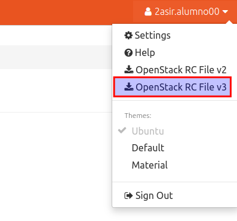

# Instalación y configuración inicial de OpenStack Client (OSC)

## Introducción
En esta actividad vamos a instalar y configurar ***OpenStack Client (OSC)*** ([https://docs.openstack.org/python-openstackclient/latest/)](https://docs.openstack.org/python-openstackclient/latest/), un cliente en línea de comandos que nos permite interactuar con las APIs de Openstack y realizar operaciones de administración y configuración.

Esta desarrollado en **Python3**, para poder usarlo es necesario por lo tanto tener instalada esta versión de Python.

Es posible **instalarlo directamente en el SO** o dentro de un **entorno virtual de python** ([https://docs.python.org/es/3/tutorial/venv.html)](https://docs.python.org/es/3/tutorial/venv.html)). 

Se muestra a continuación **tres posibles instalaciones** sobre un sistema operativo Ubuntu.

- Instalación  en un **entorno virtual de Pyhon**. Opción **recomendada**  si no quieres que las librerías interfieran con las de tu sistema.
- Instalación  directamente sobre el sistema operativo usando **PIP** (el sistema de gestión de paquetes de python).
- Instalación directamente sobre el sistema operativo **usando apt**. 

Una vez instalado veremos como realizar una configuración inicial para operar con nuestro usuario y proyecto de **OpenstackLDV**.

## Configuración
### Instalación en un entorno vitual de Python (recomendado)

Instala python3.

```
sudo apt update
sudo apt install python3
```

Instala es gestor de paquetes de python y el paquete para usar entornos virtuales

```
sudo apt install python3-pip
sudo apt-get install python3-venv
```
Crea un entorno virtual

```
python3 -m venv osc
```
Esto crea una carpeta en el directorio actual con el nombre del entorno (`osc/`). Esta carpeta contiene los directorios para instalar módulos y ejecutables de Python.

Activa el entorno

```
source osc/bin/activate
(osc)
```
Actualiza pip, el gestor de paquetes de pyton.

```
(osc)pip install -U pip
```
Instala usando pip.

```
(osc)pip install python-openstackclient
```
Prueba la versión instalada.

```
(osc)openstack --version
```

Puedes salir del entorno virtual con.

```
(osc)deactivate
$
```

### Instalación directamente sobre el sistema operativo usando PIP

Instala python3.

```
sudo apt update
sudo apt install python3
```

Instala es gestor de paquetes de python.

```
sudo apt install python3-pip
```

Actualiza pip, el gestor de paquetes de pyton.

```
pip3 install -U pip
```

Instala usando pip.

```
pip3 install python-openstackclient
```

Verifica que se ha instalado correctamente.

```
opestack --version
```

### Instalación directamente sobre el sistema operativo usando apt 

Instala el paquete.

```
sudo apt update
sudo apt install python3-openstackclient
```
Verifica que se ha instalado correctamente.

```
opestack --version
```

### Configuración inicial

Para poder  desde OSC atenticarnos en **OpenstackLDV**  con nuestro usuario en un proyecto es necesario dispone de un fichero de credenciales con un conjunto de variables de entorno creadas. Es posible crearlo a mano [(https://docs.openstack.org/python-openstackclient/rocky/configuration/index.html#configuration-files](https://docs.openstack.org/python-openstackclient/rocky/configuration/index.html#configuration-files)) o descargarlo desde nuestro perfil de Horizón.

Vamos a descargarlo y usarlo.  Los ejemplos que se muestran a continuación estás basados en la instalación usando un entorno virtual.

Accede a Horizon.

Inicia sesión con tu usuario y contraseña.

Accede la parte superior derecha en el nombre de tu usuario y descarga el archivo **OpenStack RC File v3**  en tu carpeta personal.




 

Vamos a cargar las variables de entorno del fichero usando el fichero que te has descargado.

```
(osc)$ source /home/<tu_home/2asir.alumno00-openrc.sh
Please enter your OpenStack Password for project 2asir.alumno00 as user 2asir.alumno00:
```

Nos pedirá la contraseña del usuario con el que nos hemos logado.

Ahora podemos usar el comando **openstack** para gestionar los recursos de nuestro proyecto.

-  Ver las instancias

```
(osc)openstack sever list
```

- Proyecto activo

```
(osc)openstack project list
```

- Mostrar información de tu proyecto.

```
(osc) openstack project show 2asir.alumno00
```

- Consular la ayuda

```
(os)$ openstack help
```