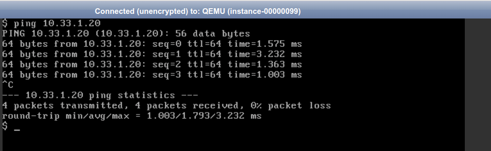

# Crear instancias-OSC
## Introducción

En esta actividad, usando *OpenStack Client*, vamos a:

- Crear una instancia en tu proyecto a partir de sabor ***tiny*** usando la imagen de **CirrOS**.
- Conectar la instancia a la **red01** creada en la actividad anterior.
- Usar la consola VNC para acceder la instancia creada y verificar su configuración IP.
- Crear otra instancia similar y verificar que hay comunicación IP entre las instancias.

Consulta información sobre **sabores** en la sección [Conceptos](../../../09-Conceptos/Conceptos.md#sabores-o-tipos-de-instancias).

Consulta información sobre **instancias** en la sección [Conceptos](../../../09-Conceptos/Conceptos.md#instancias).

## Configuración

Configura tu entorno para poder acceder a tu proyecto usando *OpenStack Client* tal y como se explica en la actividad [Instalación y configuración inicial de OpenStack Client (OSC)](../../../10-Actividades//OSC/ImágenesPúblicas-OSC/ImágenesPúblicas-OSC.md#Configuración).

Lanza las instancia con los siguientes parámetrops
- Nombre: **cirros01**.

- Imagen pública:  **CirrOS**.
- Sabor:  ***m1.tiny*** .
- Red: **red01**.

```
(osc) openstack image list
(osc) openstack flavor list
(osc) openstack network list
(osc) openstack server create --flavor m1.tiny --image LDV-cirros0.5.2-x86_64  --network red01 cirros01
```

Observa las características de la instancia creada (imagen, sabor, estado, ...). Observa que la dirección IP asignada.

```
(osc)openstack server lits
(osc)openstack server show cirros01
```

Si quieres puedes acceder a Horizon  ***Project, Compute, Instances***. Pincha sobre el nombre de la instancia **cirros01** y accede a la pestaña ***Console***. Abre en nueva pestaña la consola usado el enlace ***Click here to show only console***.


- Inicia sesión con el usuario **cirros** y la contraseña que indica **gocubsgo**.
- Consulta la IP de la máquina y verifica que tiene comunicación con la IP 10.33.1.1 (del router01).
  

- Haz ping a una dirección a una IP del instituto (por ejemplo 192.168.200.100) y verifica que no hay comunicación.
- Usa ```nslookup``` para resolver un nombre DNS y verificar que hay comunicación con Internet ya que el servidor DNS al que se pregunta es el 8.8.8.8.
  

Crea otra instancia similar con el nombre **cirros02** y verifica que hay comunicación IP entre las instancias. Tienes que seguir unos pasos simililares a los anteriores y verificar la IP de la nueva instancia.

```
(osc) openstack server create --flavor m1.tiny --image LDV-cirros0.5.2-x86_64  --network red01 cirros02
(osc)openstack server lits
(osc)openstack server show cirros01
```




Apaga las dos instancias.

```
(osc) openstack server stop cirros01
(osc) openstack server stop cirros02
(osc) openstack server list
```

