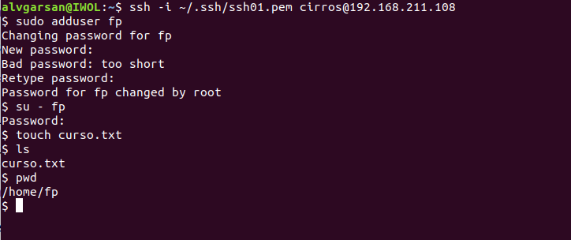
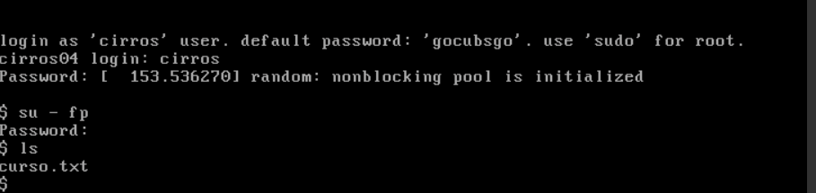

# Snapshots de instancias-OSC
## Introducción
En esta actividad, usando *OpenStack Client*,  vamos a:

- Acceder a una de las instancias existentes, crear un usuario nuevo y un fichero en el directorio home del nuevo usuario.
- Crear un snapshot de la instancia.
- Crea otra instancia similar a partir del snapshot.
- Acceder a la instancia creada y verificar que existen el fichero y el usuario.

Consulta información sobre **Snapshots** en la sección [Conceptos](../../../09-Conceptos/Conceptos.md#snapshots-de-instancias).

## Configuración

Configura tu entorno para poder acceder a tu proyecto usando *OpenStack Client* tal y como se explica en la actividad [Instalación y configuración inicial de OpenStack Client (OSC)](../../../10-Actividades//OSC/ImágenesPúblicas-OSC/ImágenesPúblicas-OSC.md#Configuración).

Consulta las instancia disponibles. 

```
(osc)openstack server list
```

Inicia la instancia **cirros03**.

```
(osc)openstack server start cirros03
```

Inicia sesión en la máquina con el usuario **cirros03** a través de la consola o mediante una conexión SSH.

- Crea el usuario curso.

```sudo adduser fp```

- Inicia sesión con el usuario fp.

```su - fp```

- Crea el fichero hola.txt .
      ```touch curso.txt```
  

Crea una ***Snapshot*** de la instancia **cirros03** con el nombre **cirros03-sn1**.

```
(osc)openstack server image create --name cirros03-sn1 cirros03
```

Consulta las imágenes disponibles y observa que la snapshot se ha almacenado como una imagen con visibilibiad ***Private*** (significa que solo es visible en tu proyecto).

```
(osc)openstack image list
```

Crea otra instancia con el nombre ***cirros04*** a partir de la snapshot creada.  

```
(osc)openstack server create --flavor m1.tiny --image cirros03-sn1 --network red01 --key-name ssh01 cirros04
(osc)openstack server list
(osc)
```

Inicia sesión en **cirros04** y verifica que existen el archivo y el usuario creados.


Apaga la instancias **cirros03** y **cirros04**

```
(osc)openstack server stop cirros03
(osc)openstack server stop cirros04
```


