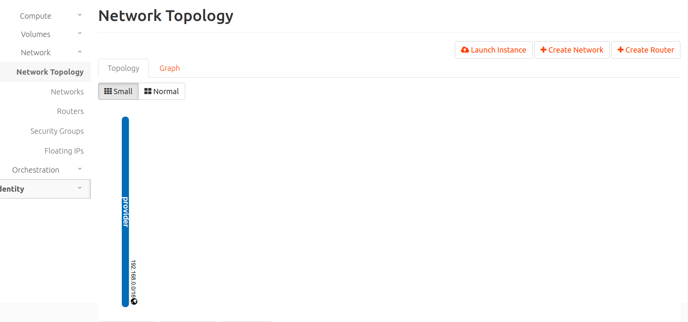
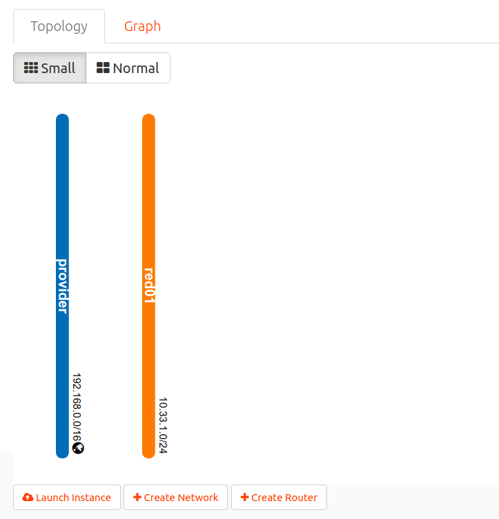
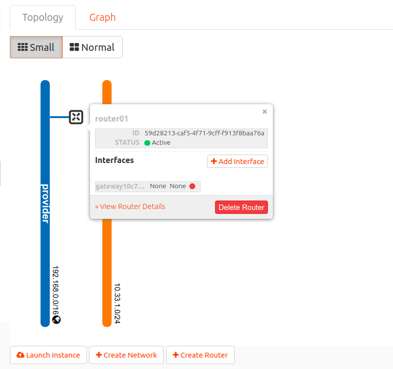
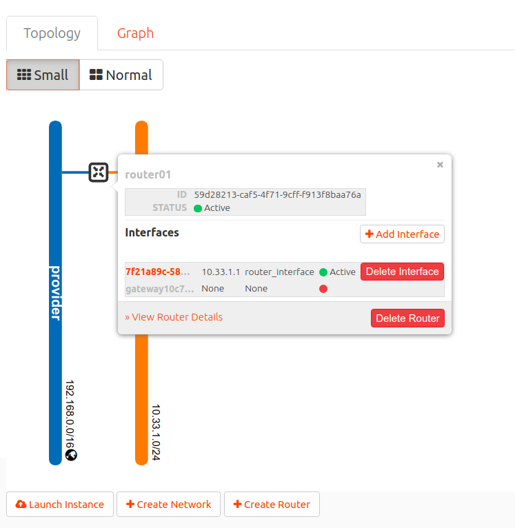

# P02-Redes y routers

En está práctica vamos crear una **red** con direccionamiento **10.33.1.0/24** (**subred** en terminología de OpenStack) y un **router** que conectará la red creada con la red del instituto (192.168.0.0/16) (red **provider** en terminología de **OpenStackLDV**).

Consulta información sobre **redes, subredes y routers** en la sección [Conceptos](../../../09-Conceptos/Conceptos.md#redes-y-dispositivos-de-red).

1. Accede a Horizon.
2. Inicia sesión con tu usuario y contraseña.
3. En el menú de la izquierda accede a ***Project, Network, Networks*** y observa que existe la red **provider**. Esta red representa a la red del instituto y es accesible desde todos los proyectos de **OpenStackLDV**. No es posible conectar directamente instancias a esta red, si se intenta crear una instancia conectada a está red se provocará un error y la instancia no se creará correctamente.

4. Accede a ***Project, Network, Routers*** y verifica que no existe ningún router en tu proyecto.
5. Accede a ***Project, Network, Network Topology*** y observa el diagrama con las redes y routers actuales. Solo existirá la red **provider**.

6. Accede ***Project, Network, Networks***.
7. Pincha en ***Create Networks*** para crear una nueva red y una nueva subred.

    7.1.  Introduce el nombre **red01** y pincha en ***Next***.

    

    7.2.  Introduce el nombre **subred01**, dirección de red **10.33.1.0/24**, gateway **10.33.1.1**, y pincha en ***Next***.

    

    7.3.  Habilita un **servidor DHCP** en la red que sirva en el rango **10.33.1.10, 10.33.1.30** y otorgue **8.8.8.8 como servidor DNS**. Pincha en ***Create*** para crear la red.

    

    

8. Accede a ***Project, Network, Network Topology*** y observa el diagrama con las redes y routers actuales. Existiran las dos redes pero no están conectadas.

9. Accede ***Project, Network, Routers***.
10. Pincha en ***Create Routers*** para crear un nuevo router. Asígnale el nombre **router01** y selecciona ***provider*** como red externa. Pincha en ***Create*** para crear el router.

11. Accede a ***Project, Network, Network Topology***  y verifica la topología de red. Observa que el router solo está conectado a la red ***provider***.

12. Accede ***Project, Network, Routers*** y pincha sobre el **router01**.
13. Accede a la pestaña ***Interfaces*** y pincha en ***Add interface***.

    13.1. Selecciona la **red01** y introduce la IP **10.33.1.1**.

    

    13.2. Pincha en ***Submit*** para crear el interfaz.

14. Accede a ***Project, Network, Network Topology***  y verifica la topología de red. Observa que se ha creado un interfaz en el router y se ha conectado con la **red01**. Fíjate en la IP que se le ha asignado al interfaz.
