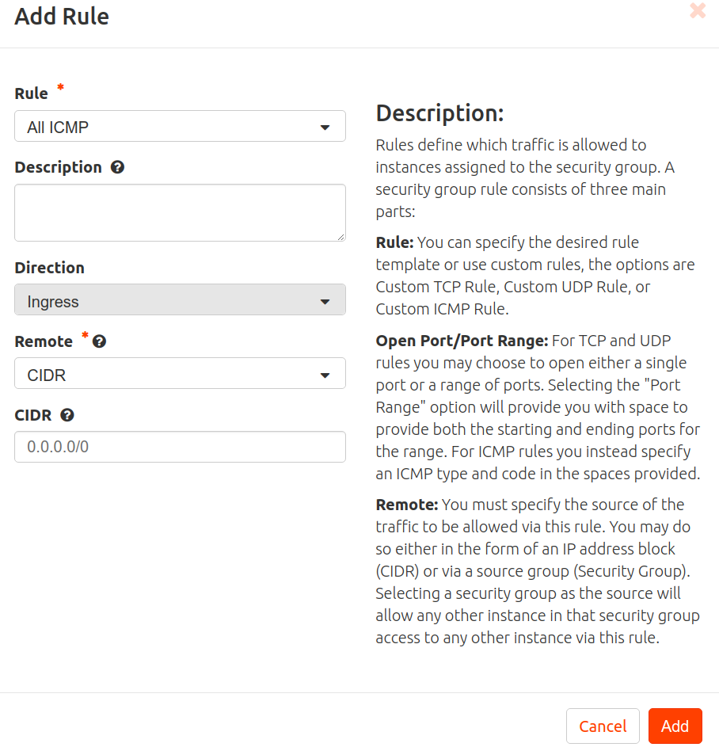
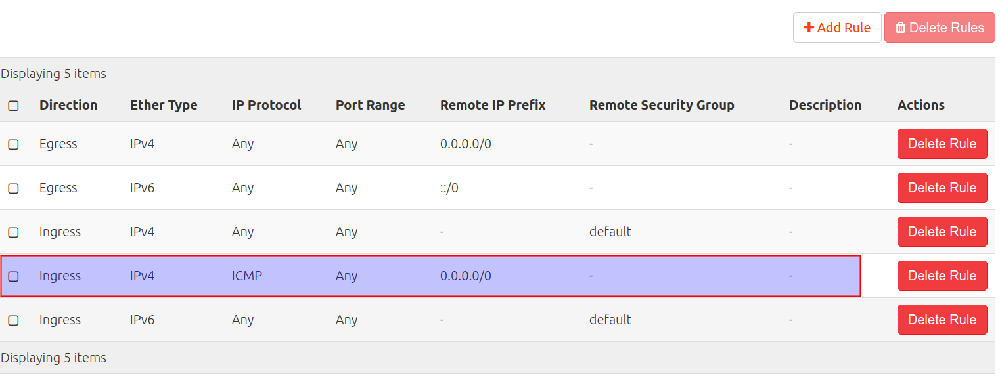

# P04-IPs flotantes y grupos de seguridad

En esta práctica vamos a:

- Asociar una **IP flotante** a una de las instancias que has creado para poder acceder desde el exterior (red del instituto).
- Crear una nueva regla en el **grupo de seguridad** ***default*** para poder hacer ping a las instancias que pertenezcan a este grupo.
- Verificar que es posible hacer ping a la IP pública de la instancia.
- Crear una nueva regla en el **grupo de seguridad** ***default*** para poder acceder por SSH a las instancias que pertenezcan a este grupo. 
- Establecer una conexión SSH con la instancia.

Consulta información sobre **ips fijas** e **ips flotantes** en la sección [Conceptos](../../../09-Conceptos/Conceptos.md#ip-fija).

1. Accede a Horizon.
2. Inicia sesión con tu usuario y contraseña.
3. Accede a ***Project, Compute, Instances***. Pincha sobre ***Start Instance*** en **cirros01** para iniciar la instancia.
4. Accede a ***Project, Compute, Network, Floating IPs***.
5. Haz clic sobre ***Allocate IP to Project*** para reservar una IPs flotante. Estás IPs en un cloud público serían direcciones de Internet. En nuestro caso son direcciones de la **red provider (192.16.0.0/16)**, la red del instituto.

6. Accede a ***Compute, Project, Instances***. En la instancia **cirros01** accede a ***Actions, Associate  Floating IP**. Selecciona la IP flotante a asociar el interfaz de red de la instancia con la que se asocia. Pincha en ***Associate***.
7. Observa la IP asociada.

8. Abre un terminal en tu equipo y haz un ping a la IP flotante.
9. Observa que no responde.

Consulta información sobre **grupos de seguridad** en la sección [Conceptos](../../../09-Conceptos/Conceptos.md#grupo-de-seguridad).
10. Accede a  ***Project, Network, Security Groups***.
11. Observa las reglas del grupo ***default*** (por defecto permite todo el tráfico de salida y acepta tráfico *ingress* del grupo, pero rechaza todo el tráfico exterior que no proceda del grupo de seguridad *default*).
12. Sobre el grupo ***default*** pincha en ***Manage Rules***.
13. Pincha en **Add Rule** y crea una regla para permitir **el tráfico ICMP de entrada desde cualquier sitio**.


14. Abre un terminal en tu equipo y haz un ping a la IP flotante y observa que ahora sí responde.

15. Pincha en **Add Rule** y crea una regla para permitir **el tráfico SSH de entrada desde cualquier sitio**.


15. Abre un terminal y establece una conexión SSH con la instancia cirros01..

    ```ssh cirros@ip_flotante```

    